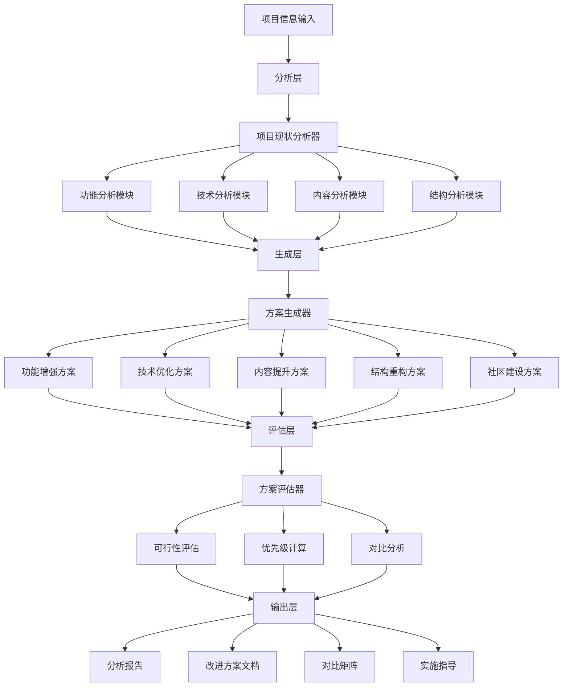

# 设计文档：Awesome QA Prompt 项目改进和优化方案

## 概述

本设计文档描述了 Awesome QA Prompt 项目改进分析系统的详细设计。该系统将分析项目当前状态，生成多个改进方案，进行对比分析，并提供优先级推荐和实施指导。

### 设计目标

1. **全面性**：覆盖项目的所有关键方面（功能、技术、内容、用户体验、社区等）
2. **实用性**：提供可执行的改进方案和详细的实施指导
3. **可比性**：提供清晰的方案对比和优先级排序
4. **可追溯性**：每个方案都能追溯到具体的项目问题或机会

### 系统边界

- **输入**：项目基本信息、目录结构、技术栈、功能列表
- **输出**：项目现状分析报告、改进方案集合、对比矩阵、优先级推荐、实施指导
- **不包含**：具体的代码实现、详细的UI设计、第三方服务集成

## 架构

### 系统架构

系统采用分析-生成-评估的三层架构：



### 核心组件

1. **项目现状分析器（Project State Analyzer）**
   - 分析项目的功能完整性
   - 分析技术架构状态
   - 分析内容质量
   - 分析目录结构
   - 识别优势和不足

2. **方案生成器（Proposal Generator）**
   - 基于分析结果生成改进方案
   - 确保方案覆盖多个维度
   - 为每个方案生成详细信息

3. **方案评估器（Proposal Evaluator）**
   - 评估方案的可行性
   - 计算方案的优先级
   - 生成对比矩阵

4. **输出格式化器（Output Formatter）**
   - 格式化分析报告
   - 格式化改进方案文档
   - 生成对比表格和图表

## 组件和接口

### 1. 项目现状分析器

#### 接口定义

```typescript
interface ProjectStateAnalyzer {
  // 分析项目整体状态
  analyzeProject(projectInfo: ProjectInfo): ProjectAnalysisReport;
  
  // 分析功能完整性
  analyzeFunctionality(projectInfo: ProjectInfo): FunctionalityAnalysis;
  
  // 分析技术架构
  analyzeTechnology(projectInfo: ProjectInfo): TechnologyAnalysis;
  
  // 分析内容质量
  analyzeContent(projectInfo: ProjectInfo): ContentAnalysis;
  
  // 分析目录结构
  analyzeStructure(projectInfo: ProjectInfo): StructureAnalysis;
}
```

#### 分析维度

**功能分析**：
- 模块完整性（15个测试类型模块的完成度）
- 工作流程覆盖（3个工作流程的实用性）
- 功能缺失识别（缺少的测试类型或工作流程）
- 功能冗余识别（重复或不必要的功能）

**技术分析**：
- 技术栈现代性（VitePress 1.0.0, Node.js 20+）
- 构建和部署流程（GitHub Actions 自动部署）
- 性能状况（加载速度、搜索性能）
- 技术债务识别（过时的依赖、不规范的代码）

**内容分析**：
- 提示词质量（专业性、完整性、可用性）
- 文档质量（README、模块文档、工作流程文档）
- 双语支持质量（中英文翻译的准确性和一致性）
- 示例和用例（是否提供足够的使用示例）

**结构分析**：
- 目录组织合理性
- 文件命名一致性
- 模块划分清晰度
- 冗余文件识别（如 Base/、articles/ 等空目录）

### 2. 方案生成器

#### 接口定义

```typescript
interface ProposalGenerator {
  // 生成所有改进方案
  generateProposals(analysis: ProjectAnalysisReport): ImprovementProposal[];
  
  // 生成特定维度的方案
  generateFunctionalProposal(analysis: FunctionalityAnalysis): ImprovementProposal;
  generateTechnicalProposal(analysis: TechnologyAnalysis): ImprovementProposal;
  generateContentProposal(analysis: ContentAnalysis): ImprovementProposal;
  generateStructureProposal(analysis: StructureAnalysis): ImprovementProposal;
  generateCommunityProposal(analysis: ProjectAnalysisReport): ImprovementProposal;
}
```

#### 方案生成策略

每个改进方案必须包含以下信息：

1. **方案标识**：唯一的方案ID（如 P1, P2, P3...）
2. **方案名称**：简短描述性名称
3. **方案描述**：详细说明方案内容和目标
4. **改进维度**：功能增强、技术优化、内容提升等
5. **实施难度**：低/中/高（基于技术复杂度、工作量、风险）
6. **预期收益**：低/中/高（基于用户价值、项目影响、长期效益）
7. **优点列表**：至少3个优点
8. **缺点列表**：至少2个缺点
9. **实施步骤概要**：3-5个主要步骤
10. **所需资源**：人力、时间、技术栈
11. **成功指标**：可衡量的成功标准

#### 方案维度覆盖

系统必须生成至少以下维度的方案：

1. **功能增强**：新增测试类型、新增工作流程、交互功能
2. **用户体验优化**：界面改进、导航优化、搜索增强
3. **技术架构改进**：性能优化、构建优化、技术升级
4. **内容质量提升**：提示词优化、文档完善、示例增加
5. **项目结构优化**：目录重构、文件整理、命名规范
6. **社区建设**：贡献指南、社区互动、生态建设
7. **国际化扩展**：多语言支持、本地化优化
8. **自动化工具链**：CI/CD 增强、质量检查、自动化测试

### 3. 方案评估器

#### 接口定义

```typescript
interface ProposalEvaluator {
  // 评估方案可行性
  evaluateFeasibility(proposal: ImprovementProposal): FeasibilityScore;
  
  // 计算方案优先级
  calculatePriority(proposal: ImprovementProposal): PriorityScore;
  
  // 生成对比矩阵
  generateComparisonMatrix(proposals: ImprovementProposal[]): ComparisonMatrix;
  
  // 识别方案依赖
  identifyDependencies(proposals: ImprovementProposal[]): DependencyGraph;
  
  // 识别快速见效方案
  identifyQuickWins(proposals: ImprovementProposal[]): ImprovementProposal[];
}
```

#### 优先级计算算法

优先级得分 = (收益分数 × 权重1) - (难度分数 × 权重2) + (可行性分数 × 权重3)

其中：
- 收益分数：高=3, 中=2, 低=1
- 难度分数：高=3, 中=2, 低=1
- 可行性分数：高=3, 中=2, 低=1
- 权重1 = 0.5（收益权重）
- 权重2 = 0.3（难度权重）
- 权重3 = 0.2（可行性权重）

**快速见效方案（Quick Wins）**识别标准：
- 实施难度 = 低
- 预期收益 = 中或高
- 可行性 = 高

#### 对比矩阵维度

对比矩阵应包含以下维度：

| 方案ID | 方案名称 | 改进维度 | 实施难度 | 预期收益 | 工作量（人天） | 实施周期 | 技术风险 | 优先级得分 |
|--------|---------|---------|---------|---------|--------------|---------|---------|-----------|
| P1     | ...     | ...     | ...     | ...     | ...          | ...     | ...     | ...       |

### 4. 输出格式化器

#### 接口定义

```typescript
interface OutputFormatter {
  // 格式化项目分析报告
  formatAnalysisReport(analysis: ProjectAnalysisReport): string;
  
  // 格式化改进方案文档
  formatProposalDocument(proposals: ImprovementProposal[]): string;
  
  // 格式化对比矩阵
  formatComparisonMatrix(matrix: ComparisonMatrix): string;
  
  // 格式化实施指导
  formatImplementationGuide(recommendations: Recommendation[]): string;
}
```

#### 输出格式规范

**Markdown 格式要求**：
- 使用标准 Markdown 语法
- 使用中文作为主要语言
- 使用适当的标题层级（# ## ### ####）
- 使用表格展示对比数据
- 使用有序列表展示优先级排序
- 使用无序列表展示优缺点
- 使用代码块展示技术细节

**文档结构**：
1. 项目现状分析报告
2. 改进方案详细文档（每个方案一个章节）
3. 方案对比矩阵
4. 优先级推荐
5. 实施指导

## 数据模型

### 核心数据结构

```typescript
// 项目信息
interface ProjectInfo {
  name: string;
  version: string;
  description: string;
  techStack: TechStack;
  modules: Module[];
  workflows: Workflow[];
  directoryStructure: DirectoryNode;
}

// 技术栈
interface TechStack {
  framework: string;  // VitePress
  version: string;    // 1.0.0
  nodeVersion: string; // 20+
  dependencies: Dependency[];
  devDependencies: Dependency[];
}

// 模块
interface Module {
  name: string;
  type: string;  // 测试类型
  files: ModuleFile[];
  completeness: number;  // 0-100
}

// 模块文件
interface ModuleFile {
  name: string;
  type: 'full' | 'lite' | 'readme';
  language: 'zh' | 'en';
  path: string;
}

// 工作流程
interface Workflow {
  name: string;
  type: string;  // daily, sprint, release
  files: WorkflowFile[];
}

// 目录节点
interface DirectoryNode {
  name: string;
  type: 'directory' | 'file';
  path: string;
  children?: DirectoryNode[];
  isEmpty?: boolean;
  isRedundant?: boolean;
}

// 项目分析报告
interface ProjectAnalysisReport {
  functionality: FunctionalityAnalysis;
  technology: TechnologyAnalysis;
  content: ContentAnalysis;
  structure: StructureAnalysis;
  strengths: string[];
  weaknesses: string[];
  opportunities: string[];
}

// 功能分析
interface FunctionalityAnalysis {
  moduleCompleteness: number;  // 0-100
  workflowCoverage: number;    // 0-100
  missingFeatures: string[];
  redundantFeatures: string[];
}

// 技术分析
interface TechnologyAnalysis {
  modernityScore: number;      // 0-100
  performanceScore: number;    // 0-100
  technicalDebt: TechnicalDebt[];
  upgradeOpportunities: string[];
}

// 内容分析
interface ContentAnalysis {
  promptQuality: number;       // 0-100
  documentationQuality: number; // 0-100
  bilingualConsistency: number; // 0-100
  exampleCoverage: number;     // 0-100
  improvementAreas: string[];
}

// 结构分析
interface StructureAnalysis {
  organizationScore: number;   // 0-100
  namingConsistency: number;   // 0-100
  redundantItems: DirectoryNode[];
  restructuringNeeds: string[];
}

// 改进方案
interface ImprovementProposal {
  id: string;                  // P1, P2, P3...
  name: string;
  description: string;
  dimension: ImprovementDimension;
  difficulty: Difficulty;      // 低/中/高
  benefit: Benefit;            // 低/中/高
  pros: string[];              // 至少3个
  cons: string[];              // 至少2个
  steps: string[];             // 3-5个步骤
  resources: ResourceRequirement;
  successMetrics: string[];
  relatedAnalysis: string[];   // 关联的分析结果
}

// 改进维度
enum ImprovementDimension {
  FUNCTIONALITY = '功能增强',
  USER_EXPERIENCE = '用户体验优化',
  TECHNOLOGY = '技术架构改进',
  PERFORMANCE = '性能优化',
  CONTENT = '内容质量提升',
  STRUCTURE = '项目结构优化',
  COMMUNITY = '社区建设',
  I18N = '国际化扩展',
  AUTOMATION = '自动化工具链',
  DOCUMENTATION = '文档和示例',
  MAINTAINABILITY = '可维护性'
}

// 难度和收益
enum Difficulty {
  LOW = '低',
  MEDIUM = '中',
  HIGH = '高'
}

enum Benefit {
  LOW = '低',
  MEDIUM = '中',
  HIGH = '高'
}

// 资源需求
interface ResourceRequirement {
  manpower: number;            // 人数
  workDays: number;            // 工作日
  techStack: string[];         // 所需技术栈
  budget?: number;             // 预算（可选）
}

// 可行性评分
interface FeasibilityScore {
  technical: number;           // 技术可行性 0-100
  resource: number;            // 资源可行性 0-100
  time: number;                // 时间可行性 0-100
  overall: number;             // 总体可行性 0-100
  risks: string[];             // 风险列表
  mitigations: string[];       // 缓解措施
}

// 优先级评分
interface PriorityScore {
  score: number;               // 优先级得分
  rank: number;                // 排名
  category: 'quick-win' | 'high-priority' | 'medium-priority' | 'low-priority';
}

// 对比矩阵
interface ComparisonMatrix {
  proposals: ImprovementProposal[];
  dimensions: string[];        // 对比维度
  data: ComparisonData[][];    // 对比数据
}

// 对比数据
interface ComparisonData {
  proposalId: string;
  dimension: string;
  value: string | number;
}

// 依赖图
interface DependencyGraph {
  nodes: DependencyNode[];
  edges: DependencyEdge[];
}

interface DependencyNode {
  proposalId: string;
  name: string;
}

interface DependencyEdge {
  from: string;                // 依赖方
  to: string;                  // 被依赖方
  type: 'requires' | 'benefits-from' | 'conflicts-with';
}

// 推荐方案
interface Recommendation {
  priority: 'short-term' | 'medium-term' | 'long-term';
  proposals: ImprovementProposal[];
  rationale: string;
  milestones: Milestone[];
}

// 里程碑
interface Milestone {
  name: string;
  description: string;
  duration: string;            // 如 "2周"
  deliverables: string[];
}
```

## 正确性属性

*属性是一个特征或行为，应该在系统的所有有效执行中保持为真——本质上是关于系统应该做什么的正式陈述。属性作为人类可读规范和机器可验证正确性保证之间的桥梁。*


### 属性 1：项目分析完整性

*对于任意*项目信息，当系统执行项目分析时，生成的分析报告应该包含所有必需的分析维度（功能完整性、技术架构状态、内容质量水平、用户体验现状、优势和不足），且每个维度都有相应的评估结果。

**验证需求：1.1, 1.2, 1.3, 1.4, 1.5, 1.6**

### 属性 2：改进方案数量和多样性

*对于任意*项目分析报告，系统生成的改进方案列表应该包含至少5个方案，且这些方案应该覆盖至少5个不同的改进维度（功能增强、用户体验优化、技术架构改进、内容质量提升、项目结构优化等）。

**验证需求：2.1, 2.2, 2.3, 2.4, 2.5, 2.6**

### 属性 3：方案完整性

*对于任意*生成的改进方案，该方案对象应该包含所有必需的字段：方案描述（非空）、实施难度（低/中/高）、预期收益（低/中/高）、优点列表（至少3项）、缺点列表（至少2项）、实施步骤概要（至少3步）。

**验证需求：2.7, 2.8, 2.9, 2.10, 2.11, 2.12**

### 属性 4：对比矩阵完整性

*对于任意*改进方案列表，系统生成的对比矩阵应该包含所有方案，且对比维度应该包括：实施难度、预期收益、资源需求、实施周期、风险评估。

**验证需求：3.1, 3.2, 3.3, 3.4, 3.5, 3.6**

### 属性 5：依赖关系分析

*对于任意*改进方案列表，系统应该生成依赖图，该依赖图包含所有方案作为节点，并识别方案之间的依赖关系（requires、benefits-from、conflicts-with），同时识别可以并行实施的方案组合。

**验证需求：3.7, 3.8**

### 属性 6：优先级计算一致性

*对于任意*改进方案，其优先级得分应该根据公式计算：优先级得分 = (收益分数 × 0.5) - (难度分数 × 0.3) + (可行性分数 × 0.2)，其中收益/难度/可行性分数的映射为：高=3, 中=2, 低=1。

**验证需求：4.1**

### 属性 7：优先级排序正确性

*对于任意*改进方案列表，系统生成的优先级排序应该按照优先级得分降序排列，即排名靠前的方案优先级得分应该大于或等于排名靠后的方案。

**验证需求：4.2**

### 属性 8：推荐方案合理性

*对于任意*改进方案列表，系统提供的推荐方案应该至少包含1个方案，且每个推荐方案都应该包含推荐理由，同时系统应该提供短期（1-3个月）、中期（3-6个月）、长期（6-12个月）三个时间段的实施建议。

**验证需求：4.3, 4.4, 4.5, 4.6, 4.7**

### 属性 9：快速见效方案识别

*对于任意*改进方案列表，系统识别的快速见效方案（Quick Wins）应该满足条件：实施难度 = 低，且预期收益 = 中或高，且可行性 = 高。

**验证需求：4.8**

### 属性 10：方案详细设计完整性

*对于任意*改进方案，该方案应该包含详细设计信息：技术实现方案、所需技术栈和工具列表、工作量估算（正数人天）、技术风险列表、成功指标列表。

**验证需求：5.1, 5.2, 5.3, 5.4, 5.5**

### 属性 11：可行性评估完整性

*对于任意*改进方案，该方案应该包含完整的可行性评估：技术可行性得分（0-100）、资源可行性得分（0-100）、时间可行性得分（0-100）、实施障碍列表、风险缓解措施列表。

**验证需求：6.1, 6.2, 6.3, 6.4, 6.5**

### 属性 12：改进维度覆盖完整性

*对于任意*项目分析报告，系统生成的改进方案列表应该覆盖所有主要改进维度：功能增强、用户体验优化、技术架构改进、性能优化、内容质量提升、社区建设、国际化扩展、自动化工具链、文档和示例、可维护性、项目结构优化。

**验证需求：7.1, 7.2, 7.3, 7.4, 7.5, 7.6, 7.7, 7.8, 7.9, 7.10, 7.11**

### 属性 13：输出格式规范性

*对于任意*系统输出，该输出应该符合 Markdown 格式规范，使用中文作为主要语言，对比矩阵使用表格格式，优先级排序使用有序列表，实施步骤使用清晰的列表格式，包含目录结构，每个方案有唯一标识符，使用适当的标题层级。

**验证需求：8.1, 8.2, 8.3, 8.4, 8.5, 8.6, 8.7, 8.8**

### 属性 14：方案可追溯性

*对于任意*改进方案，该方案应该包含可追溯性信息：关联到具体的项目现状分析结果、说明解决的具体问题、说明带来的具体价值、在方案描述中引用项目现状分析的相关部分。

**验证需求：9.1, 9.2, 9.3, 9.4**

### 属性 15：实施指导完整性

*对于任意*推荐方案，该方案应该包含完整的实施指导：详细的实施步骤、实施前的准备工作清单、实施过程中的注意事项、验收标准，同时系统应该提供方案实施的里程碑定义和进度跟踪建议。

**验证需求：10.1, 10.2, 10.3, 10.4, 10.5, 10.6**

### 属性 16：目录结构分析完整性

*对于任意*项目信息，系统对目录结构的分析应该包含：当前目录结构信息、混乱和不合理之处列表、冗余或未使用的目录和文件列表、目录命名一致性得分、文件组织逻辑性得分、目录结构最佳实践建议。

**验证需求：11.1, 11.2, 11.3, 11.4, 11.5, 11.10**

### 属性 17：重构建议完整性

*对于任意*发现目录结构问题的项目，系统提供的重构建议应该包含：新的目录结构设计、迁移步骤、重构的影响范围评估。

**验证需求：11.6, 11.7, 11.8, 11.9**

## 错误处理

### 错误类型

1. **输入验证错误**
   - 项目信息不完整或格式错误
   - 缺少必需的项目元数据
   - 目录结构信息无效

2. **分析错误**
   - 无法解析项目结构
   - 分析过程中遇到异常数据
   - 无法生成有效的分析结果

3. **方案生成错误**
   - 无法生成足够数量的方案
   - 方案维度覆盖不足
   - 方案数据不完整

4. **评估错误**
   - 优先级计算失败
   - 可行性评估数据不足
   - 依赖关系分析失败

### 错误处理策略

1. **输入验证**
   - 在分析前验证所有输入数据
   - 提供清晰的错误消息
   - 建议用户如何修正输入

2. **优雅降级**
   - 当某个分析维度失败时，继续其他维度的分析
   - 在输出中标注不完整的部分
   - 提供部分结果而不是完全失败

3. **默认值处理**
   - 为缺失的可选字段提供合理的默认值
   - 在文档中标注使用了默认值的地方

4. **错误日志**
   - 记录所有错误和警告
   - 提供调试信息帮助定位问题

### 错误恢复

1. **重试机制**
   - 对于临时性错误，自动重试
   - 设置合理的重试次数和间隔

2. **回退策略**
   - 当高级分析失败时，回退到基础分析
   - 确保至少能提供基本的分析结果

3. **用户通知**
   - 及时通知用户错误情况
   - 提供可能的解决方案

## 测试策略

### 测试方法

本项目采用双重测试策略：

1. **单元测试**：验证具体示例、边界情况和错误条件
2. **属性测试**：验证通用属性在所有输入下的正确性

### 单元测试重点

单元测试应该关注：

1. **具体示例**
   - 使用 Awesome QA Prompt 项目的实际数据进行测试
   - 验证分析结果的准确性
   - 验证方案生成的合理性

2. **边界情况**
   - 空项目（没有模块）
   - 最小项目（只有1个模块）
   - 大型项目（超过20个模块）
   - 目录结构极度混乱的项目

3. **错误条件**
   - 无效的项目信息
   - 缺失的必需字段
   - 格式错误的数据

4. **集成点**
   - 分析器与生成器的集成
   - 生成器与评估器的集成
   - 评估器与格式化器的集成

### 属性测试配置

每个属性测试应该：

1. **运行至少100次迭代**（由于随机化）
2. **使用标签引用设计文档中的属性**
   - 格式：`Feature: awesome-qa-prompt-improvements, Property {number}: {property_text}`
3. **生成随机但有效的测试数据**
   - 随机项目信息
   - 随机模块配置
   - 随机目录结构

### 属性测试库选择

根据实现语言选择合适的属性测试库：

- **TypeScript/JavaScript**: fast-check
- **Python**: Hypothesis
- **Java**: jqwik
- **Rust**: proptest

### 测试覆盖目标

- **代码覆盖率**: 至少 80%
- **属性覆盖率**: 100%（所有17个属性都有对应的测试）
- **边界情况覆盖**: 所有识别的边界情况都有单元测试

### 测试数据生成

为了支持属性测试，需要实现以下数据生成器：

1. **项目信息生成器**
   - 生成随机但有效的项目元数据
   - 生成随机的模块列表
   - 生成随机的工作流程列表

2. **目录结构生成器**
   - 生成随机的目录树
   - 包含正常结构和混乱结构
   - 包含空目录和冗余文件

3. **分析结果生成器**
   - 生成随机但一致的分析报告
   - 确保分析结果符合数据模型

4. **方案生成器**
   - 生成随机但完整的改进方案
   - 确保方案数据符合规范

### 持续集成

测试应该集成到 CI/CD 流程中：

1. **每次提交时运行单元测试**
2. **每次 PR 时运行完整测试套件**（包括属性测试）
3. **定期运行长时间属性测试**（更多迭代次数）
4. **监控测试覆盖率变化**

## 实施注意事项

### 性能考虑

1. **分析性能**
   - 对于大型项目，分析可能耗时较长
   - 考虑实现增量分析
   - 缓存分析结果

2. **方案生成性能**
   - 方案生成应该在合理时间内完成（< 10秒）
   - 避免生成过多冗余方案

3. **输出性能**
   - 大型文档的格式化可能耗时
   - 考虑流式输出

### 可扩展性

1. **新增分析维度**
   - 设计应该支持轻松添加新的分析维度
   - 使用插件式架构

2. **新增改进维度**
   - 支持添加新的改进方案类型
   - 方案生成器应该可扩展

3. **自定义评估标准**
   - 允许用户自定义优先级计算公式
   - 允许用户自定义可行性评估标准

### 维护性

1. **代码组织**
   - 清晰的模块划分
   - 每个组件职责单一
   - 良好的接口设计

2. **文档**
   - 详细的 API 文档
   - 使用示例
   - 架构说明

3. **版本控制**
   - 语义化版本号
   - 变更日志
   - 向后兼容性考虑

### 安全性

1. **输入验证**
   - 严格验证所有用户输入
   - 防止注入攻击
   - 限制输入大小

2. **输出安全**
   - 转义特殊字符
   - 防止 XSS（如果输出到 Web）

3. **资源限制**
   - 限制分析时间
   - 限制内存使用
   - 防止拒绝服务攻击
