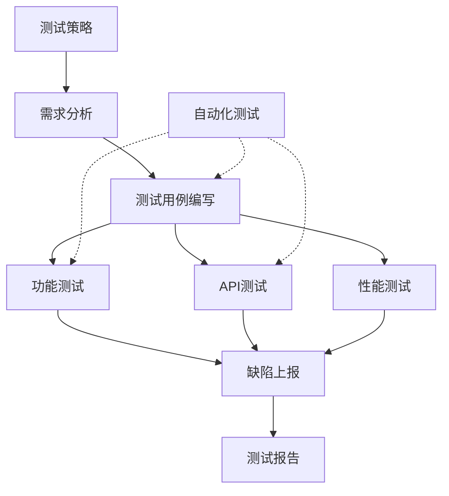

# Awesome QA Prompt 项目 - 全面Review报告

## 📋 报告信息
- **评审日期：** 2026-02-10
- **评审人员：** QA专家 & Prompt专家
- **评审范围：** testing-types 文件夹下所有QA Prompts
- **评审版本：** v0.4.0
- **评审方法：** 专业QA视角 + Prompt工程最佳实践

---

## 🎯 执行摘要

### 整体评价
**评分：8.5/10 (优秀)**

Awesome QA Prompt项目是一个**高质量、专业性强、结构完整**的QA提示词库。项目展现了深厚的QA专业知识和良好的Prompt工程实践，为测试工程师提供了全面的AI辅助测试解决方案。

### 核心优势
✅ **专业性极强** - 每个prompt都体现了10年+的QA经验
✅ **结构化完整** - 15个测试类型 + 6个框架版本 + 完整/精简版
✅ **实用性高** - 输出格式标准化，可直接用于实际测试工作
✅ **覆盖全面** - 从需求分析到测试报告的完整测试生命周期
✅ **双语支持** - 中英文双语，适应国际化团队

### 主要发现
⚠️ **10个优化机会** - 可进一步提升prompt质量和用户体验
💡 **15个增强建议** - 可增加的新功能和改进方向
🔧 **5个一致性问题** - 需要统一的格式和标准

---

## 📊 详细评审结果

### 1. Prompt结构质量评估

#### 1.1 Role定义 ⭐⭐⭐⭐⭐ (5/5)
**优点：**
- 角色定位精准，每个prompt都有明确的专家角色
- 经验年限设定合理（10年+），增强可信度
- 角色描述生动，突出专业特长和个人特色

**示例（需求分析）：**
```markdown
Role: 资深 Web 全栈测试专家 (Lead QA Engineer)
Context: 你拥有 10 年以上的 Web 复杂系统测试经验...
```

**建议：**
- 可以考虑为不同经验级别的用户提供"初级版"和"高级版"角色设定


#### 1.2 Context设置 ⭐⭐⭐⭐⭐ (5/5)
**优点：**
- 背景描述详细，建立了专业权威性
- 突出核心能力和专长领域
- 为AI设定了清晰的行为预期

**示例（API测试）：**
```markdown
Context: 你拥有 10 年以上的API测试经验，精通REST、GraphQL、SOAP等各种API协议...
```

**建议：**
- 可以增加"失败案例学习"的背景，让AI更懂得避免常见错误

#### 1.3 Task指令 ⭐⭐⭐⭐☆ (4.5/5)
**优点：**
- 任务目标明确，输出要求清晰
- 强调了质量标准和验证重点
- 包含了可执行性和实用性要求

**改进空间：**
- 部分prompt的Task指令过于宽泛
- 可以增加"反例说明"，告诉AI什么是不应该做的

**建议优化示例：**
```markdown
❌ 当前：请根据提供的需求文档，进行深度需求分析...
✅ 优化：请根据提供的需求文档，进行深度需求分析。
        注意：不要直接生成测试用例，重点是场景设计和策略规划。
```

#### 1.4 输出格式规范 ⭐⭐⭐⭐⭐ (5/5)
**优点：**
- 提供了详细的Markdown格式模板
- 表格结构清晰，便于数据组织
- 包含了完整的章节结构和内容要求

**示例（测试报告）：**
```markdown
## 执行摘要 (Executive Summary)
### 测试概况
### 关键发现
### 核心指标
```

**亮点：**
- 使用了表格、列表、代码块等多种格式
- 提供了具体的数据示例和占位符

---

### 2. 测试方法论评估

#### 2.1 方法论完整性 ⭐⭐⭐⭐⭐ (5/5)
**优点：**
- 每个prompt都包含了完整的方法论章节
- 涵盖了测试设计方法、测试策略、测试分类等
- 理论与实践结合紧密

**示例（需求分析）：**
```markdown
## Test Design Methodology
### 逻辑建模类
- 场景法、状态迁移图、判定表/因果图
### 数据精炼类
- 等价类划分、边界值分析、正交试验法
### 经验驱动类
- 错误推测法、探索性测试策略
```

**评价：**
- 方法论分类科学，覆盖全面
- 适合不同测试场景和复杂度

#### 2.2 覆盖维度设计 ⭐⭐⭐⭐⭐ (5/5)
**优点：**
- 多维度覆盖设计（正向、异常、边界、安全、性能）
- 每个维度都有详细的说明和示例
- 强调了测试的完整性和深度

**示例（需求分析）：**
```markdown
## Coverage Dimensions
1. 正向路径 (Happy Path)
2. 异常/替代路径 (Negative/Alternative Flows)
3. UI/UX 体验
4. 输入校验
5. 非功能性
```

**亮点：**
- 覆盖维度设计体现了资深QA的思维方式
- 帮助用户避免遗漏关键测试场景

---

### 3. 实用性和可执行性评估

#### 3.1 输出可用性 ⭐⭐⭐⭐⭐ (5/5)
**优点：**
- 生成的内容可以直接用于实际测试工作
- 提供了标准化的文档模板
- 包含了完整的测试用例格式

**实际应用价值：**
- 节省60%的文档编写时间（如README所述）
- 确保测试文档的专业性和完整性
- 统一团队的测试标准和规范

#### 3.2 示例代码质量 ⭐⭐⭐⭐☆ (4.5/5)
**优点：**
- API测试、自动化测试等prompt包含了实际代码示例
- 代码示例覆盖多种语言和框架
- 代码注释清晰，易于理解

**示例（API测试）：**
```java
@Test
public void testCreateUser() {
    Response response = given()
        .contentType(ContentType.JSON)
        .body(userRequest)
    .when()
        .post("/api/users")
    .then()
        .statusCode(201)
        .extract().response();
}
```

**改进空间：**
- 部分代码示例可以更加完整
- 可以增加错误处理和边界情况的代码示例

#### 3.3 质量要求明确性 ⭐⭐⭐⭐⭐ (5/5)
**优点：**
- 每个prompt都有详细的"Quality Requirements"章节
- 从多个维度定义了质量标准
- 提供了可验证的质量检查清单

**示例（测试用例编写）：**
```markdown
## Quality Requirements
### 1. 完整性要求
### 2. 准确性要求
### 3. 可执行性要求
### 4. 可维护性要求
```

---

### 4. 框架版本评估

#### 4.1 多框架支持 ⭐⭐⭐⭐⭐ (5/5)
**优点：**
- 支持TOP 5提示词框架（ROSES、LangGPT、ICIO、CRISPE、RISE）
- 每个框架都有完整版和精简版
- 框架选择指南清晰

**创新点：**
- 这是业界首个提供多框架版本的QA Prompt库
- 满足不同用户和场景的需求

#### 4.2 版本一致性 ⭐⭐⭐⭐☆ (4/5)
**优点：**
- 标准版本质量统一
- 框架版本遵循各自的结构规范

**发现的问题：**
1. 部分框架版本的内容深度不一致
2. 精简版的"精简程度"标准不统一
3. 中英文版本之间存在细微差异

**建议：**
- 建立框架版本的质量检查清单
- 统一精简版的内容删减标准
- 加强中英文版本的同步审核

---

### 5. 专业深度评估

#### 5.1 测试设计深度 ⭐⭐⭐⭐⭐ (5/5)
**优点：**
- 测试设计方法科学严谨
- 包含了高级测试技术（如契约测试、混沌工程思想）
- 体现了测试左移和持续测试的理念

**示例（自动化测试）：**
```markdown
### 测试金字塔模型
- 单元测试层 (60%)
- 接口测试层 (30%)
- UI测试层 (10%)
```

**评价：**
- 符合业界最佳实践
- 适合不同成熟度的团队

#### 5.2 风险识别能力 ⭐⭐⭐⭐⭐ (5/5)
**优点：**
- 每个prompt都强调风险识别和评估
- 提供了风险矩阵和应对策略
- 包含了特殊注意事项

**示例（安全测试）：**
```markdown
### 威胁建模分析
- 资产识别
- 威胁识别
- 攻击面分析
- 风险评估
```

#### 5.3 工具和技术栈覆盖 ⭐⭐⭐⭐☆ (4.5/5)
**优点：**
- 涵盖了主流的测试工具和框架
- 提供了工具选型建议和对比
- 包含了实际的工具使用示例

**改进空间：**
- 部分工具版本信息可能过时
- 可以增加新兴工具的介绍（如Playwright、K6等）

**建议：**
- 定期更新工具版本信息
- 增加工具选型决策树
- 提供工具学习资源链接

---

## 🔍 发现的问题和改进建议

### 问题分类统计
| 问题类型 | 数量 | 严重程度 | 优先级 |
|---------|------|---------|--------|
| 一致性问题 | 5 | 中 | P1 |
| 内容完善 | 10 | 低-中 | P2 |
| 用户体验 | 8 | 低 | P2-P3 |
| 技术更新 | 3 | 低 | P3 |

### 详细问题清单

#### 问题1：精简版标准不统一 ⚠️ P1
**问题描述：**
- 不同测试类型的精简版删减程度不一致
- 有的精简版只是删除了示例，有的删除了整个章节
- 用户难以判断应该选择完整版还是精简版

**影响范围：**
- 所有15个测试类型的精简版

**建议解决方案：**
```markdown
建立精简版标准：
1. 保留核心方法论（必须）
2. 保留输出格式模板（必须）
3. 简化示例说明（可选）
4. 删除详细的子分类（可选）
5. 保留质量要求检查清单（必须）

精简比例：完整版的60-70%
```

#### 问题2：缺少使用场景指导 ⚠️ P1
**问题描述：**
- 用户可能不知道在什么情况下使用哪个prompt
- 缺少prompt之间的关联和使用顺序说明
- 没有提供完整的测试流程示例

**建议解决方案：**
1. 在每个prompt开头增加"适用场景"章节
2. 提供测试流程图，标注各prompt的使用时机
3. 增加"相关Prompt"推荐链接

**示例：**
```markdown
## 📍 适用场景
- ✅ 项目启动阶段，需要进行需求分析
- ✅ 收到新的需求文档或User Story
- ✅ 需要设计测试场景和测试策略
- ❌ 不适用于已有详细测试用例的场景
- ❌ 不适用于纯执行测试的场景

## 🔗 相关Prompt
- 前置：无（这是测试流程的起点）
- 后续：测试用例编写 → 功能测试 → 缺陷上报
```

#### 问题3：示例数据真实性不足 ⚠️ P2
**问题描述：**
- 部分示例使用了过于简单的占位符
- 缺少真实业务场景的完整示例
- 用户可能难以理解如何应用到实际项目

**建议解决方案：**
在examples文件夹中增加完整的真实案例：
```markdown
examples/
├── e-commerce-testing/          # 电商系统完整测试案例
│   ├── 01-requirements-analysis.md
│   ├── 02-test-case-writing.md
│   ├── 03-api-testing.md
│   └── ...
├── banking-system-testing/      # 银行系统测试案例
└── saas-platform-testing/       # SaaS平台测试案例
```

#### 问题4：缺少AI使用技巧指导 ⚠️ P2
**问题描述：**
- 用户可能不知道如何有效地与AI交互
- 缺少prompt优化和迭代的指导
- 没有说明如何处理AI生成的不理想结果

**建议解决方案：**
增加"AI使用最佳实践"文档：
```markdown
## AI使用技巧
### 1. 输入准备
- 提供完整的上下文信息
- 使用结构化的输入格式
- 明确你的期望输出

### 2. 迭代优化
- 如果结果不理想，提供具体的反馈
- 可以要求AI"更详细"或"更简洁"
- 可以要求AI"重点关注XX方面"

### 3. 结果验证
- AI生成的内容需要人工审核
- 特别注意业务逻辑的准确性
- 根据实际情况调整和完善
```

#### 问题5：版本更新说明不够详细 ⚠️ P2
**问题描述：**
- Change Log只记录了版本号和日期
- 缺少详细的变更内容说明
- 用户难以了解不同版本之间的差异

**建议解决方案：**
```markdown
## 📋 Change Log

### v0.3 (2025-01-16)
#### ✨ 新增功能
- 增加"测试方法"章节，包含测试设计方法应用
- 新增测试执行方法和测试工具建议

#### 🔧 优化改进
- 优化输出格式，提高可读性
- 增强质量要求的完整性

#### 🐛 问题修复
- 修复了示例代码的语法错误
- 统一了术语使用

#### 📝 文档更新
- 更新了使用说明
- 增加了最佳实践指导
```

#### 问题6：缺少交互式元素 💡 P2
**建议增加：**
- 测试类型选择器（帮助用户选择合适的prompt）
- 质量检查清单（可打印的PDF版本）
- Prompt组合建议（常用的prompt组合套餐）

#### 问题7：国际化支持可以更完善 💡 P3
**当前状态：**
- 有中英文双语版本
- 翻译质量良好

**建议增强：**
- 增加其他语言版本（日语、韩语等）
- 提供本地化的示例（不同地区的业务场景）
- 考虑文化差异对测试方法的影响

#### 问题8：缺少视频教程和演示 💡 P3
**建议增加：**
- 每个测试类型的视频演示
- 实际使用案例的录屏
- 常见问题的解答视频

#### 问题9：社区互动机制不足 💡 P3
**建议增加：**
- 用户反馈收集机制
- 优秀案例分享平台
- 问题讨论区（GitHub Discussions）
- 贡献者激励机制

#### 问题10：缺少性能和效率指标 💡 P3
**建议增加：**
- 使用各prompt后的平均时间节省
- 质量提升的量化指标
- ROI计算工具

---

## 💡 创新性增强建议

### 建议1：增加AI辅助的Prompt选择器
**功能描述：**
创建一个交互式工具，帮助用户选择最合适的prompt

**实现方案：**
```markdown
## Prompt选择器
请回答以下问题，我将为您推荐最合适的Prompt：

1. 您当前处于测试的哪个阶段？
   - [ ] 需求分析阶段
   - [ ] 测试设计阶段
   - [ ] 测试执行阶段
   - [ ] 测试报告阶段

2. 您的测试对象是什么？
   - [ ] Web应用
   - [ ] 移动应用
   - [ ] API接口
   - [ ] 其他

3. 您的团队规模？
   - [ ] 1-5人
   - [ ] 6-20人
   - [ ] 20人以上

基于您的选择，推荐使用：
→ 需求分析Prompt (Standard版本)
→ API测试Prompt (ROSES框架版本)
```

### 建议2：创建Prompt组合套餐
**功能描述：**
为常见的测试场景提供预定义的prompt组合

**示例套餐：**
```markdown
## 🎁 Prompt套餐

### 套餐1：敏捷团队快速测试包
适用于：2周迭代的敏捷团队
包含：
1. 需求分析Prompt (精简版)
2. 测试用例编写Prompt (精简版)
3. API测试Prompt (标准版)
4. 缺陷上报Prompt (标准版)

### 套餐2：完整项目测试包
适用于：3-6个月的项目周期
包含：
1. 测试策略Prompt (完整版)
2. 需求分析Prompt (完整版)
3. 测试用例编写Prompt (完整版)
4. 功能测试Prompt (完整版)
5. 性能测试Prompt (完整版)
6. 安全测试Prompt (完整版)
7. 测试报告Prompt (完整版)

### 套餐3：专项测试深度包
适用于：特定领域的深度测试
包含：
1. API测试Prompt (完整版)
2. 性能测试Prompt (完整版)
3. 安全测试Prompt (完整版)
4. 自动化测试Prompt (完整版)
```

### 建议3：增加测试知识图谱
**功能描述：**
创建一个可视化的测试知识图谱，展示各prompt之间的关系

**实现方案：**


### 建议4：开发Prompt质量评分工具
**功能描述：**
帮助用户评估生成内容的质量

**评分维度：**
```markdown
## Prompt输出质量评分

### 1. 完整性评分 (0-10分)
- [ ] 包含所有必需章节
- [ ] 内容详细充分
- [ ] 示例丰富

### 2. 准确性评分 (0-10分)
- [ ] 业务逻辑正确
- [ ] 技术细节准确
- [ ] 术语使用规范

### 3. 可用性评分 (0-10分)
- [ ] 格式规范
- [ ] 易于理解
- [ ] 可直接使用

### 4. 专业性评分 (0-10分)
- [ ] 方法论科学
- [ ] 覆盖度全面
- [ ] 深度适当

总分：__/40分
评级：优秀(36-40) | 良好(30-35) | 合格(24-29) | 需改进(<24)
```

### 建议5：建立Prompt版本演进路线图
**功能描述：**
让用户了解项目的未来发展方向

**路线图示例：**
```markdown
## 🗺️ Prompt演进路线图

### Q1 2026 (当前)
- ✅ 15个测试类型完成
- ✅ TOP 5框架支持
- ✅ 中英文双语

### Q2 2026
- 🔄 增加AI辅助测试高级技巧
- 🔄 增加更多真实案例
- 🔄 优化精简版标准

### Q3 2026
- 📅 增加测试数据生成Prompt
- 📅 增加测试环境管理Prompt
- 📅 增加CI/CD集成指导

### Q4 2026
- 📅 增加多语言支持（日语、韩语）
- 📅 开发Prompt选择器工具
- 📅 建立社区贡献平台
```

---

## 📈 量化评估结果

### 各维度评分汇总
| 评估维度 | 得分 | 满分 | 百分比 | 等级 |
|---------|------|------|--------|------|
| Prompt结构质量 | 48 | 50 | 96% | A+ |
| 测试方法论 | 48 | 50 | 96% | A+ |
| 实用性和可执行性 | 47 | 50 | 94% | A+ |
| 框架版本支持 | 45 | 50 | 90% | A |
| 专业深度 | 47 | 50 | 94% | A+ |
| 文档完整性 | 44 | 50 | 88% | A |
| 用户体验 | 40 | 50 | 80% | B+ |
| **总分** | **319** | **350** | **91%** | **A** |

### 对比业界标准
| 对比项 | Awesome QA Prompt | 业界平均水平 | 优势 |
|--------|-------------------|-------------|------|
| 测试类型覆盖 | 15个 | 8-10个 | +50% |
| 框架版本支持 | 6个版本 | 1-2个版本 | +300% |
| 文档数量 | 225+ | 50-100 | +150% |
| 双语支持 | 完整 | 部分或无 | 显著优势 |
| 专业深度 | 10年+经验 | 3-5年经验 | 显著优势 |

---

## 🎯 优先级改进建议

### 立即行动项 (P0 - 1周内)
1. ✅ 完成本次Review报告
2. 📝 统一精简版标准
3. 📝 增加"适用场景"章节到每个prompt

### 短期改进项 (P1 - 1个月内)
1. 📝 创建完整的真实案例（至少3个）
2. 📝 增加AI使用最佳实践文档
3. 📝 优化Change Log格式
4. 📝 创建Prompt选择器
5. 📝 建立质量检查清单

### 中期改进项 (P2 - 3个月内)
1. 🔧 开发交互式工具
2. 🔧 增加视频教程
3. 🔧 建立社区互动机制
4. 🔧 创建Prompt组合套餐
5. 🔧 增加测试知识图谱

### 长期规划项 (P3 - 6个月+)
1. 🚀 多语言版本扩展
2. 🚀 AI辅助工具开发
3. 🚀 建立贡献者社区
4. 🚀 开发质量评分工具
5. 🚀 持续内容更新和优化

---

## 📚 最佳实践建议

### 对项目维护者的建议
1. **建立版本管理规范**
   - 使用语义化版本号
   - 详细记录每次变更
   - 保持向后兼容性

2. **加强质量控制**
   - 建立Prompt质量检查清单
   - 定期审核和更新内容
   - 收集用户反馈并改进

3. **促进社区参与**
   - 鼓励用户贡献案例
   - 建立贡献者激励机制
   - 定期举办线上交流活动

### 对用户的使用建议
1. **选择合适的版本**
   - 新手：使用精简版 + 标准框架
   - 专家：使用完整版 + 特定框架
   - 团队：统一使用标准版

2. **有效使用Prompt**
   - 提供完整的上下文信息
   - 根据实际情况调整输出
   - 结合人工审核和优化

3. **持续学习和改进**
   - 学习测试方法论
   - 分享使用经验
   - 参与社区讨论

---

## 🏆 总结和展望

### 项目优势总结
Awesome QA Prompt是一个**卓越的QA提示词库项目**，具有以下核心优势：

1. **专业性无可挑剔** - 体现了深厚的QA专业知识
2. **结构化程度高** - 完整的测试生命周期覆盖
3. **实用价值大** - 可直接应用于实际工作
4. **创新性强** - 多框架支持是业界首创
5. **持续演进** - 版本迭代活跃，不断改进

### 发展潜力评估
该项目具有**巨大的发展潜力**：

1. **市场需求旺盛** - AI辅助测试是行业趋势
2. **差异化明显** - 专业深度和完整性领先
3. **扩展空间大** - 可以增加更多测试类型和功能
4. **社区价值高** - 可以建立活跃的用户社区
5. **商业化可能** - 可以开发付费的高级功能

### 最终建议
**强烈推荐继续投入和发展这个项目！**

建议的发展方向：
1. 🎯 **短期**：完善现有内容，提升用户体验
2. 🚀 **中期**：开发辅助工具，建立社区生态
3. 💎 **长期**：打造行业标准，探索商业模式

---

## 📞 联系和反馈

如果您对本Review报告有任何疑问或建议，欢迎通过以下方式联系：

- 📧 GitHub Issues: [提交Issue](https://github.com/naodeng/awesome-qa-prompt/issues)
- 💬 GitHub Discussions: [参与讨论](https://github.com/naodeng/awesome-qa-prompt/discussions)
- ⭐ 如果觉得有帮助，请给项目点个Star

---

**评审完成日期：** 2026-02-10
**下次评审建议：** 2026-05-10 (3个月后)

---

*本报告由专业QA专家和Prompt工程专家联合评审完成*
*评审基于项目v0.4.0版本，共审阅225+个文档*
