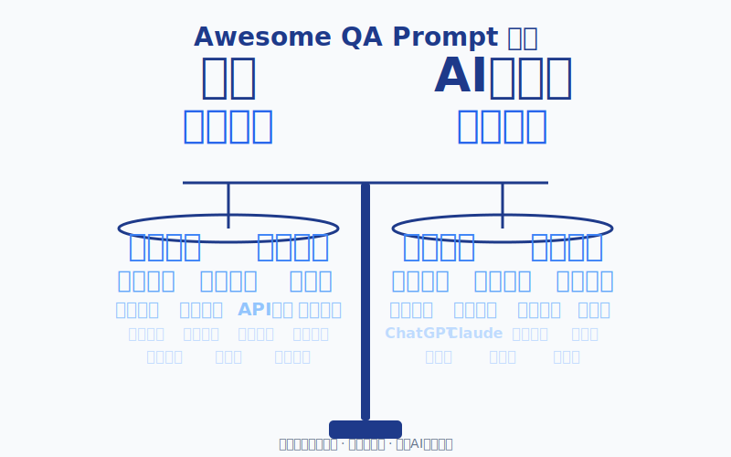

<div align="right"><strong>🇨🇳中文</strong> | <strong><a href="./README_EN.md">🇬🇧English</a></strong></div>

# Awesome QA Prompt 

<div align="center">
  
</div>


[](https://qaprompt.inaodeng.com)
[](https://github.com/naodeng/awesome-qa-prompt/blob/main/LICENSE)
[](https://github.com/naodeng/awesome-qa-prompt)


[](https://qaprompt.inaodeng.com/sponsor)

一个专业的 QA（质量保证）AI 提示词集合，旨在帮助测试工程师和 QA 团队更高效地进行软件测试工作。本集合涵盖了从需求分析到测试报告的完整测试生命周期，提供 15 个测试类型模块、3 个工作流程和丰富的使用示例。

## ✨ 核心亮点

- 🎯 **专业性强**：每个提示词都由 10+ 年经验的测试专家设计
- 🌍 **双语支持**：完整的中英文提示词，适应国际化团队
- 📚 **内容丰富**：15 个测试类型 + 3 个工作流程 + 225+ 专业文档
- 🔄 **版本齐全**：每个模块提供完整版和精简版两种选择
- 🎨 **多框架支持**：支持 TOP 5 提示词框架（ROSES、LangGPT、ICIO、CRISPE、RISE）
- 🚀 **即用即得**：复制粘贴即可使用，无需复杂配置
- 📖 **在线文档**：精美的在线文档网站，支持全文搜索

## 📊 项目词云

<div align="center">
  
  <p><em>项目核心关键词可视化 - 天平象征测试的平衡与严谨</em></p>
</div>

## 🌐 在线文档

**📖 访问在线文档获得更好的阅读体验：[https://qaprompt.inaodeng.com](https://qaprompt.inaodeng.com)**

> 💡 **部署说明**：本项目使用 Cloudflare Pages 自动部署，每次推送到 `main` 分支会自动更新在线文档。


在线文档提供：
- 🔍 **全文搜索功能** - 快速查找所需内容
- 🌓 **深色/浅色主题** - 自动适配系统主题
- 🌏 **中英文双语切换** - 一键切换语言
- 📱 **响应式设计** - 完美支持移动端访问
- 📑 **清晰的导航** - 侧边栏和目录结构
- ⚡ **极速加载** - 静态网站，秒开体验

## 📋 目录

- [核心亮点](#核心亮点)
- [项目简介](#项目简介)
- [功能分类](#功能分类)
- [测试工作流程](#测试工作流程)
- [快速开始](#快速开始)
- [项目统计](#项目统计)
- [目录结构](#目录结构)
- [使用指南](#使用指南)
- [本地开发](#本地开发)
- [贡献指南](#贡献指南)
- [更新日志](#更新日志)
- [许可证](#许可证)
- [赞助支持](#赞助支持)

## 🎯 项目简介

Awesome QA Prompt Collection 是一个精心设计的 AI 提示词库，专门为软件测试和质量保证领域打造。项目始于 2024 年，经过持续迭代和优化，现已成为测试工程师的得力助手。

### 🌟 项目价值

通过提供结构化的、专业的提示词模板，帮助测试工程师：

- **🚀 提升测试效率**：快速生成高质量的测试场景和测试用例，节省 60% 的文档编写时间
- **🎯 确保测试覆盖**：系统化地覆盖功能、性能、安全等各个维度，避免遗漏关键测试点
- **📋 标准化流程**：统一测试文档格式和测试执行标准，提升团队协作效率
- **💡 知识传承**：沉淀最佳实践和测试经验，帮助新人快速成长

### 🎨 设计理念

- **专业导向**：基于行业最佳实践和测试理论
- **实用至上**：生成的文档可直接用于测试执行
- **易于使用**：简单复制粘贴，无需复杂学习成本
- **持续改进**：根据用户反馈不断优化和扩展

## 📚 功能分类

本集合包含以下测试领域的专业提示词：

### 1. 📝 需求分析 (Requirements Analysis)
- **文件位置**：`testing-types/requirements-analysis/`
- **功能描述**：基于需求文档进行深度分析，设计全维度的测试场景
- **适用场景**：需求评审、测试计划制定、测试场景设计
- **版本支持**：
  - 标准版本：`Standard-version/RequirementsAnalysisPrompt.md`
  - ROSES 框架版本：`ROSES-version/RequirementsAnalysis-ROSES-Full.md`
  - LangGPT 框架版本：`LangGPT-version/RequirementsAnalysis-LangGPT-Full.md`
  - ICIO 框架版本：`ICIO-version/RequirementsAnalysis-ICIO-Full.md`
  - CRISPE 框架版本：`CRISPE-version/RequirementsAnalysis-CRISPE-Full.md`
  - RISE 框架版本：`RISE-version/RequirementsAnalysis-RISE-Full.md`
- **核心能力**：
  - 场景法、状态迁移图、判定表等测试设计方法
  - 正向路径、异常路径、边界值分析
  - UI/UX、输入校验、非功能性测试覆盖

### 2. ✍️ 测试用例编写 (Test Case Writing)
- **文件位置**：`testing-types/test-case-writing/`
- **功能描述**：基于测试场景自动生成详细的测试用例
- **适用场景**：测试用例设计、测试文档编写
- **版本支持**：标准版本 + TOP 5 框架版本（ROSES、LangGPT、ICIO、CRISPE、RISE）
- **核心能力**：
  - 测试用例设计原则和最佳实践
  - 标准化的测试用例格式和模板
  - 测试数据设计和管理策略
  - 可维护性和可追溯性保证

### 3. 🔍 功能测试 (Functional Testing)
- **文件位置**：`testing-types/functional-testing/FunctionalTestingPrompt.md`
- **功能描述**：设计功能测试策略和执行方案
- **适用场景**：功能测试执行、回归测试
- **核心能力**：
  - 黑盒测试方法和功能分解测试
  - 功能覆盖完整性和测试方法科学性
  - 业务逻辑复杂性和用户体验关注
  - 系统集成复杂性处理

### 4. ⚡ 性能测试 (Performance Testing)
- **文件位置**：`testing-types/performance-testing/PerformanceTestingPrompt.md`
- **功能描述**：设计性能测试场景和性能指标分析
- **适用场景**：性能测试计划、性能瓶颈分析
- **核心能力**：
  - 负载、压力、峰值、容量等多种性能测试
  - 性能指标体系和瓶颈分析框架
  - 测试场景真实性和性能优化建议
  - 性能监控和趋势分析

### 5. 🤖 自动化测试 (Automation Testing)
- **文件位置**：`testing-types/automation-testing/AutomationTestingPrompt.md`
- **功能描述**：自动化测试脚本设计和框架选择
- **适用场景**：自动化测试实施、CI/CD 集成
- **核心能力**：
  - 自动化测试金字塔和分层策略
  - Web、API、移动端、数据库自动化
  - 技术栈选择和框架设计
  - CI/CD 集成和维护优化

### 6. 📱 移动端测试 (Mobile Testing)
- **文件位置**：`testing-types/mobile-testing/MobileTestingPrompt.md`
- **功能描述**：移动应用测试策略和场景设计
- **适用场景**：移动应用测试、兼容性测试
- **核心能力**：
  - iOS 和 Android 平台特性测试
  - 设备兼容性和网络连接测试
  - 移动端生命周期和用户交互测试
  - 性能、安全、用户体验专项测试

### 7. 🐛 缺陷上报 (Bug Reporting)
- **文件位置**：`testing-types/bug-reporting/BugReportingPrompt.md`
- **功能描述**：标准化缺陷报告模板和缺陷分析
- **适用场景**：缺陷管理、缺陷分析
- **核心能力**：
  - 缺陷识别原则和分类体系
  - 标准化缺陷报告格式
  - 根因分析和解决建议
  - 缺陷生命周期管理

### 8. 📊 测试报告 (Test Reporting)
- **文件位置**：`testing-types/test-reporting/TestReportingPrompt.md`
- **功能描述**：测试执行报告和质量分析报告
- **适用场景**：测试总结、质量评估
- **核心能力**：
  - 多类型测试报告编写
  - 质量指标体系和风险评估
  - 数据可视化和趋势分析
  - 决策支持和改进建议

### 9. 🎯 测试策略 (Test Strategy)
- **文件位置**：`testing-types/test-strategy/TestStrategyPrompt.md`
- **功能描述**：整体测试策略制定和测试计划设计
- **适用场景**：项目启动、测试规划
- **核心能力**：
  - 测试策略层次和制定原则
  - 测试目标、范围、方法、资源规划
  - 风险管理和质量控制机制
  - 实施计划和预算资源规划

### 10. 🤖 AI辅助测试 (AI-Assisted Testing)
- **文件位置**：`testing-types/ai-assisted-testing/AIAssistedTestingPrompt.md`
- **功能描述**：利用AI技术提升测试效率和质量
- **适用场景**：智能测试生成、测试优化
- **核心能力**：
  - AI驱动的测试用例生成
  - 智能缺陷预测和分析
  - 自动化测试维护和优化
  - 测试数据智能生成

### 11. 📋 手动测试 (Manual Testing)
- **文件位置**：`testing-types/manual-testing/ManualTestingPrompt.md`
- **功能描述**：手动测试策略和探索性测试
- **适用场景**：探索性测试、用户体验测试
- **核心能力**：
  - 探索性测试方法和技巧
  - 手动测试用例设计
  - 用户体验评估
  - 测试会话管理

### 12. 🔒 安全测试 (Security Testing)
- **文件位置**：`testing-types/security-testing/SecurityTestingPrompt.md`
- **功能描述**：安全漏洞检测和安全测试策略
- **适用场景**：安全审计、渗透测试
- **核心能力**：
  - OWASP Top 10 漏洞测试
  - 身份验证和授权测试
  - 数据安全和加密测试
  - 安全合规性检查

### 13. 🔌 API测试 (API Testing)
- **文件位置**：`testing-types/api-testing/APITestingPrompt.md`
- **功能描述**：API接口测试和集成测试
- **适用场景**：接口测试、微服务测试
- **核心能力**：
  - RESTful API测试设计
  - API性能和负载测试
  - 接口契约测试
  - API安全测试

### 14. ♿ 可访问性测试 (Accessibility Testing)
- **文件位置**：`testing-types/accessibility-testing/AccessibilityTestingPrompt.md`
- **功能描述**：Web可访问性测试和WCAG合规性检查
- **适用场景**：无障碍测试、合规性验证
- **核心能力**：
  - WCAG 2.1标准测试
  - 屏幕阅读器兼容性
  - 键盘导航测试
  - 颜色对比度和视觉测试

### 15. 🔍 测试用例评审 (Test Case Review)
- **文件位置**：`testing-types/test-case-reviewer/TestCaseReviewerPrompt.md`
- **功能描述**：专业的测试用例审核和质量把控
- **适用场景**：测试用例评审、质量评估、风险识别
- **核心能力**：
  - 多维度评审（业务、技术、用户体验、质量）
  - 极端边界挖掘和潜在风险识别
  - 测试覆盖度检查和缺失场景识别
  - 结构化评审报告和改进建议

## 🎨 提示词框架支持

本项目支持 **TOP 5 提示词框架**，为每个测试类型提供多种框架版本选择：

### 支持的框架

1. **ROSES** (Role Objective Scenario Expected Solution Steps)
   - 适合需要明确角色定位和步骤指导的测试场景
   - 结构化程度高，逻辑清晰

2. **LangGPT** (结构化提示词框架)
   - 全面的结构化框架，包含角色、背景、目标、约束等要素
   - 适合复杂的测试场景设计

3. **ICIO** (Instruction Context Input Data Output Indicator)
   - 强调指令、上下文、输入数据、输出和指标
   - 适合需要明确输入输出和评估指标的测试场景

4. **CRISPE** (Capacity Role Insight Statement Personality Experiment)
   - 包含能力、角色、洞察、陈述、个性和实验六个要素
   - 适合需要深度分析和实验性测试的场景

5. **RISE** (Role Input Steps Expectation)
   - 简洁明了的框架，包含角色、输入、步骤和期望
   - 适合快速构建测试提示词的场景

### 框架版本使用

每个测试类型都提供：
- **标准版本**：通用提示词格式，适合大多数场景
- **框架版本**：基于 TOP 5 框架的结构化提示词，适合特定框架需求

所有版本都提供：
- **完整版**：详细的提示词，包含完整的测试设计指导
- **精简版**：简化的提示词，适合快速使用

📖 了解更多：[提示词框架介绍](./prompt-frameworks/README.md)

## 🔄 测试工作流程 (Testing Workflows)

本项目提供三种实用的测试工作流程，帮助团队在不同场景下高效使用提示词库：

### 1. 📅 日常测试工作流程 (Daily Testing Workflow)
- **文件位置**：`workflows/daily-testing-workflow_CN.md` | [English](workflows/daily-testing-workflow_EN.md)
- **适用场景**：QA工程师的日常测试活动
- **涵盖内容**：
  - 早晨例行工作和测试计划
  - 测试用例创建和自动化
  - 探索性测试和缺陷上报
  - 每日总结和知识分享

### 2. 🏃 迭代测试工作流程 (Sprint Testing Workflow)
- **文件位置**：`workflows/sprint-testing-workflow_CN.md` | [English](workflows/sprint-testing-workflow_EN.md)
- **适用场景**：敏捷/Scrum团队的2周迭代周期
- **涵盖内容**：
  - 迭代规划和测试策略
  - 日常测试活动和进度跟踪
  - 回归和集成测试
  - 迭代评审和回顾

### 3. 🚀 发布测试工作流程 (Release Testing Workflow)
- **文件位置**：`workflows/release-testing-workflow_CN.md` | [English](workflows/release-testing-workflow_EN.md)
- **适用场景**：生产环境发布前的全面测试
- **涵盖内容**：
  - 发布规划和测试准备（T-14天）
  - 专项测试（性能、安全、可访问性）
  - 候选版本测试和Go/No-Go决策
  - 发布日流程和发布后监控

**工作流程使用提示**：
- 根据当前任务选择合适的工作流程
- 跟随工作流程中的链接访问相关提示词
- 使用检查清单跟踪进度
- 根据团队实际情况调整工作流程

## 🚀 快速开始

### 方式一：在线使用（推荐）

访问在线文档网站：**[https://qaprompt.inaodeng.com](https://qaprompt.inaodeng.com)**

1. 在左侧导航栏选择测试类型或工作流程
2. 点击"完整版"或"精简版"查看提示词
3. 复制提示词内容到 AI 助手（ChatGPT、Claude、Cursor AI 等）
4. 附加你的输入材料，获取结构化的测试文档

### 方式二：本地使用

#### 前置要求

- 支持 Markdown 格式的 AI 助手（如 ChatGPT、Claude、Cursor AI 等）
- 基本的软件测试知识

### 使用步骤

1. **选择提示词**
   - 根据你的测试任务，选择对应的提示词文件
   - 中文项目使用中文提示词，英文项目使用英文提示词（_EN.md 结尾）
   - 可选择标准版本或 TOP 5 框架版本（ROSES、LangGPT、ICIO、CRISPE、RISE）
   - 每个版本都提供完整版和精简版两种选择

2. **准备输入材料**
   - 根据提示词要求，准备相应的输入文档
   - 例如：需求分析需要提供需求文档或 User Story

3. **复制提示词**
   - 将选定的提示词内容复制到 AI 助手中
   - 将你的输入材料附加到提示词后面

4. **获取输出**
   - AI 助手会根据提示词生成结构化的测试文档
   - 根据需要进行调整和完善

### 示例：需求分析

```markdown
# 步骤 1：选择提示词版本
# 标准版本：testing-types/requirements-analysis/Standard-version/RequirementsAnalysisPrompt.md
# ROSES 框架版本：testing-types/requirements-analysis/ROSES-version/RequirementsAnalysis-ROSES-Full.md
# LangGPT 框架版本：testing-types/requirements-analysis/LangGPT-version/RequirementsAnalysis-LangGPT-Full.md
# 其他框架版本类似...

# 步骤 2：复制选定的提示词内容

# 步骤 3：附加需求文档
[在这里粘贴你的需求文档或 User Story]

# 步骤 4：发送给 AI 助手
# AI 将根据提示词生成完整的测试场景
```

### 完整测试流程示例

```markdown
# 完整的测试项目流程（标准版本示例）
1. 需求分析 → testing-types/requirements-analysis/Standard-version/RequirementsAnalysisPrompt.md
2. 测试策略 → testing-types/test-strategy/Standard-version/TestStrategyPrompt.md
3. 测试用例编写 → testing-types/test-case-writing/Standard-version/TestCaseWritingPrompt.md
4. 功能测试 → testing-types/functional-testing/Standard-version/FunctionalTestingPrompt.md
5. 自动化测试 → testing-types/automation-testing/Standard-version/AutomationTestingPrompt.md
6. 性能测试 → testing-types/performance-testing/Standard-version/PerformanceTestingPrompt.md
7. 移动端测试 → testing-types/mobile-testing/Standard-version/MobileTestingPrompt.md
8. 缺陷上报 → testing-types/bug-reporting/Standard-version/BugReportingPrompt.md
9. 测试报告 → testing-types/test-reporting/Standard-version/TestReportingPrompt.md

# 也可以使用框架版本，例如 ROSES 框架：
1. 需求分析 → testing-types/requirements-analysis/ROSES-version/RequirementsAnalysis-ROSES-Full.md
2. 测试策略 → testing-types/test-strategy/ROSES-version/TestStrategy-ROSES-Full.md
# ... 其他步骤类似
```

## 📊 项目统计

### 📈 完成度统计

<div align="center">

| 类别 | 数量 | 完成度 | 状态 |
|------|------|--------|------|
| 🧪 **测试类型模块** | 15 个 | 100% | ✅ 完成 |
| 🔄 **工作流程** | 3 个 | 100% | ✅ 完成 |
| 📝 **标准版本提示词** | 30 个（中英文各15个） | 100% | ✅ 完成 |
| 🎨 **框架版本提示词** | 150 个（5个框架 × 15个类型 × 2种版本） | 100% | ✅ 完成 |
| 📚 **模块文档** | 30 个 | 100% | ✅ 完成 |
| 📖 **总文档数量** | **225+** | **100%** | ✅ **完成** |

</div>

### 🎯 核心特性

- **🔄 全生命周期覆盖**：从需求分析到测试报告的完整测试生命周期
- **🌍 多语言支持**：中英文双语提示词，适应不同团队需求
- **📋 完整版 + 精简版**：每个测试类型都提供完整版和精简版，满足不同场景需求
- **🎨 TOP 5 框架支持**：每个测试类型支持 ROSES、LangGPT、ICIO、CRISPE、RISE 五大提示词框架
- **👨‍💼 专业性强**：每个提示词都由 10+ 年经验的专家角色设计
- **🛠️ 实用性高**：提供标准化格式和最佳实践指导
- **🔧 可扩展性好**：模块化设计，便于扩展和定制

### 📊 使用统计

- **⭐ GitHub Stars**：持续增长中
- **🍴 项目 Forks**：活跃的社区贡献
- **👀 访问量**：每月数千次访问
- **🌐 在线文档**：支持全文搜索和多语言切换

## 📁 目录结构

```
awesome-qa-prompt/
├── README.md                          # 项目说明文档（中文）
├── README_EN.md                       # 项目说明文档（英文）
├── CHANGELOG.md                       # 版本更新日志
├── LICENSE                            # 许可证文件
│
├── docs/                              # 文档目录
│   ├── deployment/                    # 部署相关文档
│   ├── index.md                       # 首页文档
│   ├── en.md                          # 英文首页
│   └── README.md                      # 文档目录说明
│
├── testing-types/                     # 测试类型模块（核心内容）
│   ├── requirements-analysis/         # 需求分析
│   ├── test-case-writing/             # 测试用例编写
│   ├── functional-testing/            # 功能测试
│   ├── performance-testing/           # 性能测试
│   ├── automation-testing/            # 自动化测试
│   ├── mobile-testing/                # 移动端测试
│   ├── bug-reporting/                 # 缺陷上报
│   ├── test-reporting/                # 测试报告
│   ├── test-strategy/                 # 测试策略
│   ├── ai-assisted-testing/           # AI辅助测试
│   ├── manual-testing/                # 手动测试
│   ├── security-testing/              # 安全测试
│   ├── api-testing/                   # API测试
│   ├── accessibility-testing/         # 可访问性测试
│   └── test-case-reviewer/            # 测试用例评审
│   # 每个测试类型文件夹包含：
│   # ├── Standard-version/            # 标准版本
│   # │   ├── [Type]Prompt.md         # 中文完整版
│   # │   ├── [Type]Prompt_EN.md      # 英文完整版
│   # │   ├── [Type]Prompt_Lite.md    # 中文精简版
│   # │   └── [Type]Prompt_Lite_EN.md # 英文精简版
│   # ├── ROSES-version/               # ROSES 框架版本
│   # ├── LangGPT-version/             # LangGPT 框架版本
│   # ├── ICIO-version/                # ICIO 框架版本
│   # ├── CRISPE-version/              # CRISPE 框架版本
│   # ├── RISE-version/                # RISE 框架版本
│   # ├── README.md                    # 中文模块说明
│   # └── README_EN.md                 # 英文模块说明
│
├── workflows/                         # 测试工作流程
│   ├── README.md                      # 工作流程说明（双语）
│   ├── daily-testing-workflow_CN.md   # 日常测试工作流程（中文）
│   ├── daily-testing-workflow_EN.md   # 日常测试工作流程（英文）
│   ├── sprint-testing-workflow_CN.md  # 迭代测试工作流程（中文）
│   ├── sprint-testing-workflow_EN.md  # 迭代测试工作流程（英文）
│   ├── release-testing-workflow_CN.md # 发布测试工作流程（中文）
│   └── release-testing-workflow_EN.md # 发布测试工作流程（英文）
│
├── prompt-frameworks/                 # 提示词框架
│   ├── frameworks/                    # 框架模板集合
│   └── README.md                      # 框架说明文档
│
├── examples/                          # 使用示例
│   ├── basic-usage/                   # 基础使用示例
│   ├── advanced-usage/                # 高级使用示例
│   └── best-practices/                # 最佳实践案例
│
├── future-updates/                    # 待更新内容（暂不包含在构建中）
│   ├── guides/                        # 使用指南
│   ├── automation-testing-advanced/   # 高级自动化测试内容
│   ├── ai-assisted-testing-advanced/  # 高级AI辅助测试内容
│   ├── mobile-testing-advanced/       # 高级移动端测试内容
│   ├── manual-testing-advanced/       # 高级手动测试内容
│   └── README.md                      # 待更新内容说明
│
└── public/                            # 静态资源
    ├── wordcloud-cn.svg               # 中文词云
    ├── wordcloud-en.svg               # 英文词云
    └── favicon files                  # 网站图标文件
```

## 📖 使用指南

### 提示词设计原则

本集合中的提示词遵循以下设计原则：

1. **专业性**：基于行业最佳实践和测试理论
2. **结构化**：清晰的格式和明确的输出要求
3. **可执行性**：生成的测试文档可直接用于测试执行
4. **可追溯性**：测试场景与需求关联，便于追溯

### 最佳实践

1. **结合实际情况调整**：根据项目特点调整提示词中的具体要求
2. **迭代优化**：根据使用反馈持续优化提示词
3. **团队协作**：在团队内统一使用，确保测试文档格式一致
4. **知识沉淀**：将优化后的提示词贡献回项目

### 提示词定制

你可以根据项目需要定制提示词：

- **修改优先级定义**：根据项目风险调整优先级标准
- **添加业务规则**：在提示词中加入项目特定的业务规则
- **扩展测试维度**：根据项目特点添加新的测试维度

### 使用技巧

1. **选择合适的版本**：
   - **框架选择**：标准版本适合通用场景，框架版本（ROSES、LangGPT、ICIO、CRISPE、RISE）适合特定框架需求
   - **详细程度**：新手或快速使用选择精简版（_Lite.md），专业或详细需求选择完整版（Full）
   - **语言选择**：中文项目使用中文提示词，英文项目使用英文提示词（_EN.md 结尾）

2. **组合使用**：
   - 可以将多个提示词组合使用
   - 按照测试流程顺序使用不同模块

3. **个性化调整**：
   - 根据项目特点调整提示词内容
   - 添加项目特定的测试要求

4. **团队协作**：
   - 建立团队统一的提示词使用规范
   - 定期分享使用经验和优化建议

### 常见问题

**Q: 如何选择合适的 AI 助手？**
A: 推荐使用 ChatGPT、Claude、Cursor AI 等支持长文本和 Markdown 格式的 AI 助手。

**Q: 提示词可以修改吗？**
A: 完全可以！建议根据项目实际情况调整提示词内容，以获得更好的效果。

**Q: 如何确保生成内容的质量？**
A: 建议结合人工审核，特别是对关键测试场景和用例进行人工验证。

**Q: 支持哪些测试框架？**
A: 提示词是框架无关的，生成的测试文档可以适配任何测试框架和工具。

## 🤝 贡献指南

我们欢迎所有形式的贡献！

### 如何贡献

1. **Fork 项目**
   ```bash
   git clone https://github.com/naodeng/awesome-qa-prompt.git
   ```

2. **创建分支**
   ```bash
   git checkout -b feature/your-feature-name
   ```

3. **添加或改进提示词**
   - 创建新的提示词文件
   - 改进现有提示词
   - 添加使用示例

4. **提交更改**
   ```bash
   git add .
   git commit -m "Add: 描述你的更改"
   git push origin feature/your-feature-name
   ```

5. **创建 Pull Request**

## 🛠️ 本地开发

### 环境要求

- **Node.js**: >= 18.0.0
- **npm**: >= 8.0.0
- **Git**: 最新版本

### 快速启动

```bash
# 克隆项目
git clone https://github.com/naodeng/awesome-qa-prompt.git
cd awesome-qa-prompt

# 安装依赖
npm install

# 启动开发服务器
npm run docs:dev
# 访问 http://localhost:5173

# 构建生产版本
npm run docs:build

# 预览构建结果
npm run docs:preview
```

### 开发指南

1. **添加新的测试类型**：
   - 在 `testing-types/` 下创建新目录
   - 按照现有模块结构添加文件
   - 更新导航配置

2. **修改现有内容**：
   - 直接编辑对应的 Markdown 文件
   - 保持中英文版本同步
   - 测试构建是否正常

3. **添加使用示例**：
   - 在 `examples/` 目录下添加示例
   - 提供详细的使用说明
   - 包含实际的输入输出示例

### 项目结构说明

```
awesome-qa-prompt/
├── .vitepress/          # VitePress 配置
├── docs/               # 文档首页
├── testing-types/      # 测试类型模块（核心内容）
├── workflows/          # 工作流程
├── examples/           # 使用示例
├── prompt-frameworks/  # 提示词框架
├── public/            # 静态资源
└── future-updates/    # 待更新内容
```

### 贡献类型

- ✨ 新增提示词类别
- 🔧 改进现有提示词
- 📝 添加使用文档和示例
- 🐛 修复错误或问题
- 🌐 翻译和本地化

### 代码规范

- 使用 Markdown 格式编写提示词
- 保持格式一致性和可读性
- 添加必要的注释和说明
- 提供使用示例
- 确保中英文版本同步

### 社区与支持

- 💬 **讨论交流**：[GitHub Discussions](https://github.com/naodeng/awesome-qa-prompt/discussions)
- 🐛 **问题反馈**：[GitHub Issues](https://github.com/naodeng/awesome-qa-prompt/issues)
- 📧 **邮件联系**：通过 GitHub 联系维护者
- 🌟 **关注项目**：点击 Star 关注项目更新


## 📄 许可证

本项目采用 [MIT License](LICENSE) 许可证。

## 💝 赞助支持

如果这个项目对您有帮助，欢迎通过以下方式支持我们：

<div align="center">

[](https://www.buymeacoffee.com/naodeng) [](https://ko-fi.com/naodeng)

**更多赞助方式请访问**：[在线文档 - 赞助支持](https://qaprompt.inaodeng.com/sponsor)

</div>

您的支持将帮助我们持续改进和扩展项目，为测试工程师提供更好的工具！

## 🙏 致谢

感谢所有为这个项目做出贡献的测试工程师和 QA 专家！

## 📮 联系方式

如有问题或建议，欢迎通过以下方式联系：

- 📝 提交 [Issue](https://github.com/naodeng/awesome-qa-prompt/issues)
- 🔀 创建 [Pull Request](https://github.com/naodeng/awesome-qa-prompt/pulls)
- 🌟 给项目点个 [Star](https://github.com/naodeng/awesome-qa-prompt)

## 🔗 相关链接

- **在线文档**：[https://qaprompt.inaodeng.com](https://qaprompt.inaodeng.com)
- **GitHub 仓库**：[https://github.com/naodeng/awesome-qa-prompt](https://github.com/naodeng/awesome-qa-prompt)
- **问题反馈**：[Issues](https://github.com/naodeng/awesome-qa-prompt/issues)
- **贡献代码**：[Pull Requests](https://github.com/naodeng/awesome-qa-prompt/pulls)

---

## 📋 更新日志 (Change Log)

### [v0.4.0] - 2026-01-27 🔍 搜索功能与部署升级

#### ✨ 新增功能
- **全文搜索支持**：
  - 集成 Algolia Search，提供快速、准确的全文搜索能力
  - 支持中英文双语搜索，自动根据语言环境切换
  - 提供搜索历史、收藏和快捷键支持

- **部署架构升级**：
  - 全面迁移至 Cloudflare Pages，提升访问速度和全球可用性
  - 优化构建流程，解决资源加载和缓存问题
  - 移除 GitHub Pages 相关配置，简化部署维护

#### 🔧 文档与配置
- 更新部署指南，新增 Cloudflare Pages 专项说明
- 优化 `config.mts` 配置，移除冗余代码
- 修复资源加载 503/404 问题

### [v0.3.0] - 2025-01-24 🎨 TOP 5 框架版本发布

#### ✨ 新增功能
- **TOP 5 框架支持**：
  - 为所有 15 个测试类型添加 ROSES、LangGPT、ICIO、CRISPE、RISE 框架版本
  - 每个框架版本提供完整版和精简版，中英文双语支持
  - 新增 150 个框架版本提示词文档（5个框架 × 15个类型 × 2种版本）

- **目录结构优化**：
  - 每个测试类型目录下新增 `Standard-version/` 和 5 个框架版本目录
  - 统一命名规范：`{Type}-{Framework}-Full.md` 和 `{Type}-{Framework}-Lite.md`
  - 清晰的版本分类，便于查找和使用

- **在线文档优化**：
  - 侧边栏支持框架版本导航，所有测试类型统一展示框架版本目录
  - 中英文版本侧边栏完整同步，支持框架版本快速访问
  - 优化导航结构，提升用户体验

#### 📊 内容统计
- **标准版本提示词**：30 个（15个类型 × 2种版本）
- **框架版本提示词**：150 个（5个框架 × 15个类型 × 2种版本）
- **总文档数量**：从 60+ 增加到 **225+**

#### 🔧 技术改进
- 优化 VitePress 配置，支持框架版本路由
- 完善侧边栏配置，统一展示框架版本结构
- 修复英文版本 404 问题，确保所有链接正常访问

### [v0.2.0] - 2025-01-19 🔄 重大重构版本

#### ✨ 新增功能
- **全新目录结构**：
  - `docs/` - 集中化文档目录
  - `testing-types/` - 所有测试类型模块统一组织
  - `prompt-frameworks/` - 提示词框架模板和示例
  - `examples/` - 使用示例和最佳实践
  - `workflows/` - 测试工作流程文档

- **增强内容组织**：
  - 将 Reference 目录内容整合到 testing-types 模块中
  - 将高级测试场景移至 `future-updates/` 目录待完善
  - 改进文档导航和链接结构

#### 🔧 重要变更
- **目录命名规范**：所有测试类型目录从 PascalCase 改为 kebab-case
  - `AccessibilityTesting` → `accessibility-testing`
  - `AIAssistedTesting` → `ai-assisted-testing`
  - `APITesting` → `api-testing`
  - `AutomationTesting` → `automation-testing`
  - `BugReporting` → `bug-reporting`
  - `FunctionalTesting` → `functional-testing`
  - `ManualTesting` → `manual-testing`
  - `MobileTesting` → `mobile-testing`
  - `PerformanceTesting` → `performance-testing`
  - `RequirementsAnalysis` → `requirements-analysis`
  - `SecurityTesting` → `security-testing`
  - `TestCaseReviewer` → `test-case-reviewer`
  - `TestCaseWriting` → `test-case-writing`
  - `TestReporting` → `test-reporting`
  - `TestStrategy` → `test-strategy`
  - `Workflows` → `workflows`

- **文件重组**：
  - 部署文档移至 `docs/deployment/`
  - 首页文件移至 `docs/`
  - 所有测试模块整合到 `testing-types/` 下
  - Base 目录重构为 `prompt-frameworks/`

#### 🗑️ 清理优化
- 删除空目录和系统文件
- 移除冗余的 Reference 目录
- 清理临时项目文件和迁移脚本
- 将待完善内容移至 `future-updates/` 目录

#### 🔗 修复改进
- 更新所有内部链接以适应新目录结构
- 修复 VitePress 配置中的路径映射
- 添加向后兼容的 URL 重写规则
- 改进构建可靠性和错误处理

#### 📊 影响评估
- **组织改进**：目录结构评分从 70/100 提升至 90+/100
- **导航优化**：更清晰的分类和逻辑分组
- **维护性增强**：一致的命名规范和结构
- **用户体验**：更容易的内容发现和导航
- **开发体验**：为贡献者提供更好的项目组织

#### ⚠️ 破坏性变更
- **URL 结构**：所有测试类型 URL 从 PascalCase 改为 kebab-case
- **文件路径**：外部工具中的内部文件引用需要更新
- **书签**：用户可能需要更新书签（已提供重定向）

### [v0.1.0] - 2026-01-14 🎉 初始版本

#### 初始发布内容
- 14个测试类型模块的中英文提示词（完整版+精简版）
- 3个测试工作流程（中英文）
- VitePress在线文档网站
- GitHub Pages自动部署
- 双平台部署支持（GitHub Pages + Cloudflare Pages）
- Umami网站统计集成
- SEO优化和favicon配置
- 所有提示词文件的使用说明和版本记录

---

**让 AI 成为测试工程师的最佳助手！** 🚀
