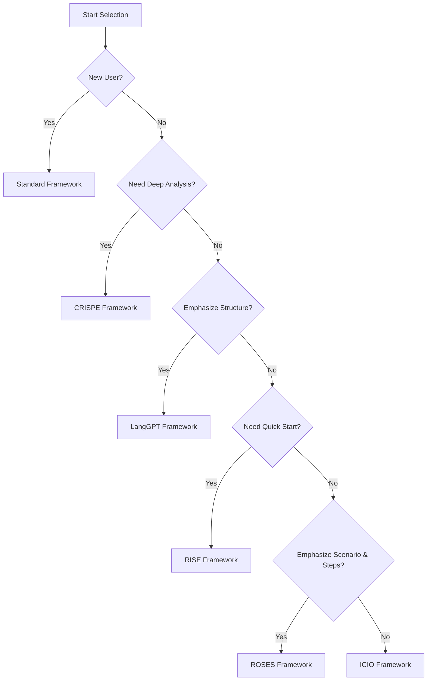

# Prompt Framework Selection Guide

[中文版本](./framework-selection-guide.md)

## 📖 Introduction

This guide helps you choose the most suitable prompt framework based on different testing scenarios and requirements. We provide 6 prompt frameworks, each with unique advantages and applicable scenarios.

## 🎯 Quick Selection Flowchart



## 📊 Framework Comparison Table

| Framework | Complexity | Learning Curve | Output Quality | Use Cases | Recommendation |
|-----------|------------|----------------|----------------|-----------|----------------|
| **Standard** | ⭐ | Easy | ⭐⭐⭐⭐ | General | ⭐⭐⭐⭐⭐ |
| **ROSES** | ⭐⭐⭐ | Medium | ⭐⭐⭐⭐⭐ | Complex Projects | ⭐⭐⭐⭐⭐ |
| **LangGPT** | ⭐⭐⭐⭐ | Hard | ⭐⭐⭐⭐⭐ | Systematic | ⭐⭐⭐⭐ |
| **ICIO** | ⭐⭐ | Easy | ⭐⭐⭐⭐ | Data-Driven | ⭐⭐⭐⭐ |
| **CRISPE** | ⭐⭐⭐ | Medium | ⭐⭐⭐⭐⭐ | Deep Analysis | ⭐⭐⭐⭐⭐ |
| **RISE** | ⭐⭐ | Easy | ⭐⭐⭐⭐ | Quick Tasks | ⭐⭐⭐⭐ |

## 🔍 Detailed Framework Selection Guide

### 1. Standard Framework - Universal Choice

**Suitable For:**
- ✅ First-time AI-assisted testing users
- ✅ Teams needing quick onboarding
- ✅ Users unfamiliar with framework structures

**Core Structure:**
```markdown
Role: Role definition
Context: Background context
Task: Specific task
```

**Advantages:**
- Simple and intuitive structure
- Low learning cost
- Wide applicability

**Usage Recommendations:**
- Suitable for daily testing tasks
- Recommended as entry-level framework
- Quick test plan generation

**Example Scenarios:**
- API test plan design
- Test case writing
- Bug report generation

---

### 2. ROSES Framework - Best for Complex Projects

**Suitable For:**
- ✅ Projects requiring detailed step guidance
- ✅ Complex testing scenarios
- ✅ Tasks needing clear roles and scenarios

**Core Structure:**
```markdown
Role: Role
Objective: Objective
Scenario: Scenario
Expected Solution: Expected solution
Steps: Steps
```

**Advantages:**
- Most complete framework
- Covers role, objective, scenario, solution, and steps
- Suitable for complex tasks requiring detailed guidance

**Usage Recommendations:**
- Suitable for large testing projects
- Tasks requiring phased execution
- Scenarios demanding detailed steps

**Example Scenarios:**
- Complete test strategy formulation
- Performance testing for complex systems
- Multi-phase security testing plans

---

### 3. LangGPT Framework - Systematic Expert Choice

**Suitable For:**
- ✅ Highly structured projects
- ✅ Pursuing maintainability and reusability
- ✅ Test engineers with programming mindset

**Core Structure:**
```markdown
# Role: Role name
## Profile:
- author: Author
- version: Version
- language: Language
- description: Description

## Goals: Goals
## Constrains: Constraints
## Skills: Skills
## Workflows: Workflows
## Initialization: Initialization
```

**Advantages:**
- Most systematic framework
- Template design, easy to maintain
- Supports variables and modularization

**Usage Recommendations:**
- Suitable for long-term maintained testing frameworks
- Team collaboration projects
- Scenarios requiring version control

**Example Scenarios:**
- Enterprise-level test system construction
- Reusable test template development
- Standardized test process design

---

### 4. ICIO Framework - Data-Driven Preferred

**Suitable For:**
- ✅ Scenarios emphasizing input/output
- ✅ Need clear evaluation metrics
- ✅ Data-driven testing projects

**Core Structure:**
```markdown
Instruction: Instruction
Context: Context
Input Data: Input data
Output Indicator: Output indicator
```

**Advantages:**
- Emphasizes data flow
- Clear input/output
- Easy to quantify evaluation

**Usage Recommendations:**
- Suitable for API testing
- Data validation scenarios
- Tests requiring clear metrics

**Example Scenarios:**
- API interface testing
- Database testing
- Performance metric validation

---

### 5. CRISPE Framework - Deep Analysis Preferred

**Suitable For:**
- ✅ Scenarios requiring in-depth analysis
- ✅ Clear output style requirements
- ✅ Need multiple example references

**Core Structure:**
```markdown
Capacity and Role: Capacity and role
Insight: Insight
Statement: Statement
Personality: Personality
Experiment: Experiment
```

**Advantages:**
- Emphasizes capability and insight
- Supports personalized output
- Encourages diverse examples

**Usage Recommendations:**
- Suitable for tests requiring deep analysis
- Specific style output requirements
- Need multiple solution comparisons

**Example Scenarios:**
- Security testing deep analysis
- Performance bottleneck diagnosis
- Multi-solution test strategy design

---

### 6. RISE Framework - Quick Task Tool

**Suitable For:**
- ✅ Tasks needing quick completion
- ✅ Simple and clear testing scenarios
- ✅ Time-critical projects

**Core Structure:**
```markdown
Role: Role
Input: Input
Steps: Steps
Expectation: Expectation
```

**Advantages:**
- Most concise framework
- Quick to start
- High execution efficiency

**Usage Recommendations:**
- Suitable for urgent tasks
- Simple testing scenarios
- Quick idea validation

**Example Scenarios:**
- Quick bug verification
- Simple functional testing
- Ad-hoc testing tasks

---

## 🎨 Scenario-Based Selection Recommendations

### By Testing Type

#### API Testing
1. **Preferred**: ICIO Framework (emphasizes input/output)
2. **Alternative**: Standard Framework (general scenarios)
3. **Deep**: CRISPE Framework (detailed analysis needed)

#### Performance Testing
1. **Preferred**: ROSES Framework (detailed steps needed)
2. **Alternative**: LangGPT Framework (systematic approach)
3. **Quick**: RISE Framework (quick validation)

#### Security Testing
1. **Preferred**: CRISPE Framework (deep analysis)
2. **Alternative**: ROSES Framework (complete process)
3. **Systematic**: LangGPT Framework (standardized)

#### Functional Testing
1. **Preferred**: Standard Framework (general scenarios)
2. **Alternative**: ROSES Framework (complex features)
3. **Quick**: RISE Framework (simple features)

#### Test Case Writing
1. **Preferred**: ROSES Framework (detailed steps)
2. **Alternative**: Standard Framework (regular cases)
3. **Systematic**: LangGPT Framework (templated)

### By Project Scale

#### Small Projects (< 1 month)
- **Recommended**: Standard, RISE
- **Reason**: Quick start, efficiency priority

#### Medium Projects (1-6 months)
- **Recommended**: ROSES, ICIO
- **Reason**: Balance complexity and completeness

#### Large Projects (> 6 months)
- **Recommended**: LangGPT, CRISPE
- **Reason**: Systematic, strong maintainability

### By Team Experience

#### Junior Teams
- **Recommended**: Standard → RISE → ICIO
- **Learning Path**: Simple to complex, progressive

#### Intermediate Teams
- **Recommended**: ROSES → ICIO → CRISPE
- **Learning Path**: Focus on practicality and depth

#### Senior Teams
- **Recommended**: LangGPT → CRISPE → Custom
- **Learning Path**: Systematization and customization

---

## 💡 Usage Tips

### 1. Hybrid Usage Strategy
Different testing phases can use different frameworks:
- **Requirements Analysis**: Standard or ROSES
- **Test Design**: LangGPT or CRISPE
- **Test Execution**: ICIO or RISE
- **Result Analysis**: CRISPE or ROSES

### 2. Progressive Learning
Recommended learning order:
1. Standard (Foundation)
2. RISE (Simplified)
3. ICIO (Data)
4. ROSES (Complete)
5. CRISPE (Deep)
6. LangGPT (Systematic)

### 3. Version Selection Recommendations
Each framework has Full and Lite versions:
- **Full Version**: Suitable for complex projects, detailed output
- **Lite Version**: Suitable for quick tasks, concise output

**Selection Recommendations:**
- First-time use: Start with Lite version to familiarize with structure
- Formal projects: Use Full version for complete output
- Time-critical: Use Lite version for quick completion

---

## 📚 Practical Cases

### Case 1: E-commerce Platform API Testing

**Project Characteristics:**
- Medium-sized project
- Numerous API interfaces
- Detailed test plan needed

**Framework Choice:** ICIO Framework

**Rationale:**
- Emphasizes input/output validation
- Suitable for API testing scenarios
- Facilitates data-driven testing

### Case 2: Financial System Security Testing

**Project Characteristics:**
- Large-scale project
- High security requirements
- Deep analysis needed

**Framework Choice:** CRISPE Framework

**Rationale:**
- Supports deep security analysis
- Provides multiple testing approaches
- Emphasizes professionalism and insight

### Case 3: Mobile App Functional Testing

**Project Characteristics:**
- Small project
- Relatively simple features
- Time-critical

**Framework Choice:** RISE Framework

**Rationale:**
- Quick to start
- Concise and efficient
- Meets basic testing needs

---

## 🔄 Framework Migration Guide

### From Standard to ROSES
**Applicable Scenario:** Increased project complexity

**Migration Steps:**
1. Retain Role and Task sections
2. Expand Context into Scenario
3. Add Objective and Expected Solution
4. Detail Steps section

### From RISE to CRISPE
**Applicable Scenario:** Need deeper analysis

**Migration Steps:**
1. Expand Role to Capacity and Role
2. Transform Input into Insight
3. Expand Expectation into Statement
4. Add Personality and Experiment

---

## ❓ FAQ

### Q1: How to choose between Full and Lite versions?
**A:** 
- Learning phase: Lite version
- Formal projects: Full version
- Quick tasks: Lite version
- Complex projects: Full version

### Q2: Can I mix multiple frameworks?
**A:** Yes. Different testing phases can use different frameworks, but it's recommended to maintain framework consistency within the same phase.

### Q3: Which framework is best for beginners?
**A:** Standard Framework. Simple structure, low learning cost, wide applicability.

### Q4: How to evaluate if framework selection is appropriate?
**A:** Observe these indicators:
- AI output quality meets requirements
- Ease of use
- Team understanding
- Improved work efficiency

---

## 📖 Related Resources

- [TOP 5 Frameworks Introduction](./top5-frameworks-intro_EN.md)
- [Detailed Framework Documentation](./frameworks/)
- [Testing Type Application Examples](../testing-types/)

---

**Last Updated**: 2026-01-28
**Version**: v1.0
