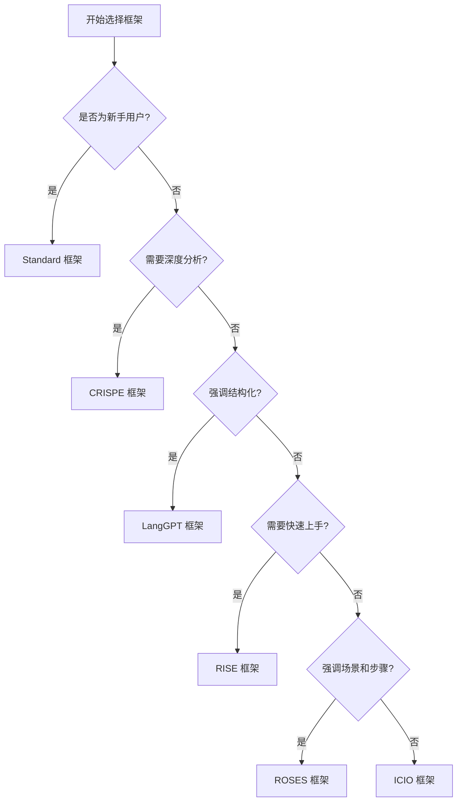

# 提示词框架选择指南

[English Version](./framework-selection-guide_EN.md)

## 📖 简介

本指南旨在帮助您根据不同的测试场景和需求,选择最适合的提示词框架。我们提供了6种提示词框架,每种框架都有其独特的优势和适用场景。

## 🎯 快速选择流程图



## 📊 框架对比表

| 框架 | 复杂度 | 学习曲线 | 输出质量 | 适用场景 | 推荐指数 |
|------|--------|----------|----------|----------|----------|
| **Standard** | ⭐ | 简单 | ⭐⭐⭐⭐ | 通用场景 | ⭐⭐⭐⭐⭐ |
| **ROSES** | ⭐⭐⭐ | 中等 | ⭐⭐⭐⭐⭐ | 复杂项目 | ⭐⭐⭐⭐⭐ |
| **LangGPT** | ⭐⭐⭐⭐ | 较难 | ⭐⭐⭐⭐⭐ | 系统化项目 | ⭐⭐⭐⭐ |
| **ICIO** | ⭐⭐ | 简单 | ⭐⭐⭐⭐ | 数据驱动 | ⭐⭐⭐⭐ |
| **CRISPE** | ⭐⭐⭐ | 中等 | ⭐⭐⭐⭐⭐ | 深度分析 | ⭐⭐⭐⭐⭐ |
| **RISE** | ⭐⭐ | 简单 | ⭐⭐⭐⭐ | 快速任务 | ⭐⭐⭐⭐ |

## 🔍 详细框架选择指南

### 1. Standard 框架 - 通用首选

**适合人群:**
- ✅ 初次使用AI辅助测试的用户
- ✅ 需要快速上手的团队
- ✅ 对框架结构不太熟悉的用户

**核心结构:**
```markdown
Role: 角色定位
Context: 背景上下文
Task: 具体任务
```

**优势:**
- 结构简单直观
- 学习成本低
- 适用范围广

**使用建议:**
- 适合日常测试任务
- 推荐作为入门框架
- 可以快速生成测试方案

**示例场景:**
- API测试方案设计
- 测试用例编写
- 缺陷报告生成

---

### 2. ROSES 框架 - 复杂项目最佳

**适合人群:**
- ✅ 需要详细步骤指导的项目
- ✅ 复杂的测试场景
- ✅ 需要明确角色和场景的任务

**核心结构:**
```markdown
Role: 角色
Objective: 目标
Scenario: 场景
Expected Solution: 预期解决方案
Steps: 步骤
```

**优势:**
- 框架最完整
- 覆盖角色、目标、场景、方案和步骤
- 适合需要详细指导的复杂任务

**使用建议:**
- 适合大型测试项目
- 需要分阶段执行的任务
- 要求输出详细步骤的场景

**示例场景:**
- 完整的测试策略制定
- 复杂系统的性能测试方案
- 多阶段的安全测试计划

---

### 3. LangGPT 框架 - 系统化专家选择

**适合人群:**
- ✅ 需要高度结构化的项目
- ✅ 追求可维护性和可复用性
- ✅ 有编程思维的测试工程师

**核心结构:**
```markdown
# Role: 角色名称
## Profile:
- author: 作者
- version: 版本
- language: 语言
- description: 描述

## Goals: 目标
## Constrains: 约束
## Skills: 技能
## Workflows: 工作流程
## Initialization: 初始化
```

**优势:**
- 最系统化的框架
- 模板化设计,易于维护
- 支持变量和模块化

**使用建议:**
- 适合需要长期维护的测试框架
- 团队协作项目
- 需要版本管理的场景

**示例场景:**
- 企业级测试体系建设
- 可复用的测试模板开发
- 标准化测试流程设计

---

### 4. ICIO 框架 - 数据驱动优选

**适合人群:**
- ✅ 强调输入输出的场景
- ✅ 需要明确评估指标
- ✅ 数据驱动的测试项目

**核心结构:**
```markdown
Instruction: 指令
Context: 上下文
Input Data: 输入数据
Output Indicator: 输出指标
```

**优势:**
- 强调数据流向
- 明确输入输出
- 便于量化评估

**使用建议:**
- 适合API测试
- 数据验证场景
- 需要明确指标的测试

**示例场景:**
- API接口测试
- 数据库测试
- 性能指标验证

---

### 5. CRISPE 框架 - 深度分析首选

**适合人群:**
- ✅ 需要深入分析的场景
- ✅ 对输出风格有明确要求
- ✅ 需要多个示例参考

**核心结构:**
```markdown
Capacity and Role: 能力和角色
Insight: 洞察
Statement: 声明
Personality: 个性
Experiment: 实验
```

**优势:**
- 强调能力和洞察
- 支持个性化输出
- 鼓励多样化示例

**使用建议:**
- 适合需要深度分析的测试
- 要求特定风格输出
- 需要多个方案对比

**示例场景:**
- 安全测试深度分析
- 性能瓶颈诊断
- 测试策略多方案设计

---

### 6. RISE 框架 - 快速任务利器

**适合人群:**
- ✅ 需要快速完成的任务
- ✅ 简单明了的测试场景
- ✅ 时间紧迫的项目

**核心结构:**
```markdown
Role: 角色
Input: 输入
Steps: 步骤
Expectation: 期望
```

**优势:**
- 最简洁的框架
- 快速上手
- 执行效率高

**使用建议:**
- 适合紧急任务
- 简单测试场景
- 快速验证想法

**示例场景:**
- 快速缺陷验证
- 简单功能测试
- 临时测试任务

---

## 🎨 场景化选择建议

### 按测试类型选择

#### API测试
1. **首选**: ICIO框架 (强调输入输出)
2. **备选**: Standard框架 (通用场景)
3. **深度**: CRISPE框架 (需要详细分析)

#### 性能测试
1. **首选**: ROSES框架 (需要详细步骤)
2. **备选**: LangGPT框架 (系统化方案)
3. **快速**: RISE框架 (快速验证)

#### 安全测试
1. **首选**: CRISPE框架 (深度分析)
2. **备选**: ROSES框架 (完整流程)
3. **系统**: LangGPT框架 (标准化)

#### 功能测试
1. **首选**: Standard框架 (通用场景)
2. **备选**: ROSES框架 (复杂功能)
3. **快速**: RISE框架 (简单功能)

#### 测试用例编写
1. **首选**: ROSES框架 (详细步骤)
2. **备选**: Standard框架 (常规用例)
3. **系统**: LangGPT框架 (模板化)

### 按项目规模选择

#### 小型项目 (< 1个月)
- **推荐**: Standard、RISE
- **理由**: 快速上手,效率优先

#### 中型项目 (1-6个月)
- **推荐**: ROSES、ICIO
- **理由**: 平衡复杂度和完整性

#### 大型项目 (> 6个月)
- **推荐**: LangGPT、CRISPE
- **理由**: 系统化,可维护性强

### 按团队经验选择

#### 初级团队
- **推荐**: Standard → RISE → ICIO
- **学习路径**: 从简单到复杂,循序渐进

#### 中级团队
- **推荐**: ROSES → ICIO → CRISPE
- **学习路径**: 注重实用性和深度

#### 高级团队
- **推荐**: LangGPT → CRISPE → 自定义
- **学习路径**: 系统化和定制化

---

## 💡 使用技巧

### 1. 混合使用策略
不同测试阶段可以使用不同框架:
- **需求分析**: Standard或ROSES
- **测试设计**: LangGPT或CRISPE
- **测试执行**: ICIO或RISE
- **结果分析**: CRISPE或ROSES

### 2. 渐进式学习
建议学习顺序:
1. Standard (基础)
2. RISE (简化)
3. ICIO (数据)
4. ROSES (完整)
5. CRISPE (深度)
6. LangGPT (系统)

### 3. 版本选择建议
每个框架都有Full和Lite版本:
- **Full版**: 适合复杂项目,输出详细
- **Lite版**: 适合快速任务,输出精简

**选择建议:**
- 初次使用: 先用Lite版熟悉结构
- 正式项目: 使用Full版获得完整输出
- 时间紧迫: 使用Lite版快速完成

---

## 📚 实战案例

### 案例1: 电商平台API测试

**项目特点:**
- 中型项目
- API接口众多
- 需要详细测试方案

**框架选择:** ICIO框架

**理由:**
- 强调输入输出验证
- 适合API测试场景
- 便于数据驱动测试

### 案例2: 金融系统安全测试

**项目特点:**
- 大型项目
- 安全要求高
- 需要深度分析

**框架选择:** CRISPE框架

**理由:**
- 支持深度安全分析
- 提供多种测试方案
- 强调专业性和洞察力

### 案例3: 移动应用功能测试

**项目特点:**
- 小型项目
- 功能相对简单
- 时间紧迫

**框架选择:** RISE框架

**理由:**
- 快速上手
- 简洁高效
- 满足基本测试需求

---

## 🔄 框架迁移指南

### 从Standard迁移到ROSES
**适用场景:** 项目复杂度增加

**迁移步骤:**
1. 保留Role和Task部分
2. 将Context扩展为Scenario
3. 添加Objective和Expected Solution
4. 细化Steps部分

### 从RISE迁移到CRISPE
**适用场景:** 需要更深入的分析

**迁移步骤:**
1. Role扩展为Capacity and Role
2. Input转化为Insight
3. Expectation扩展为Statement
4. 添加Personality和Experiment

---

## ❓ 常见问题

### Q1: 如何选择Full版还是Lite版?
**A:** 
- 学习阶段: Lite版
- 正式项目: Full版
- 快速任务: Lite版
- 复杂项目: Full版

### Q2: 可以混合使用多个框架吗?
**A:** 可以。不同测试阶段可以使用不同框架,但建议在同一阶段保持框架一致性。

### Q3: 哪个框架最适合新手?
**A:** Standard框架。结构简单,学习成本低,适用范围广。

### Q4: 如何评估框架选择是否合适?
**A:** 观察以下指标:
- AI输出质量是否满足需求
- 使用是否顺手
- 团队是否容易理解
- 是否提高了工作效率

---

## 📖 相关资源

- [TOP 5 框架介绍](./top5-frameworks-intro.md)
- [框架详细文档](/Base/PromptExample/README)
- [测试类型应用示例](/RequirementsAnalysis/)

---

**最后更新**: 2026-01-28
**版本**: v1.0
